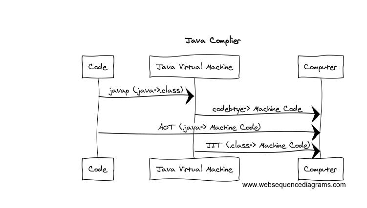

## 关于Java平台的理解

>  Java是一种面向的对象的编程语言，建立在`C++`基础之上，号称“书写一次，到处运行”（Write once, run anywhere），在多平台可以快速移植，具有超强的跨平台能力。拥有强大的内存回收机制(GC，Garbage Collection)，Java通过垃圾收集器对JVM内存回收。

​	`JRE`和`JDK`，作为Java程序员对这两个名词并不没收，`JRE`提供Java运行时环境，包含了JVM和一些内置的库函数，另外的`JDK`，它里面包含了`JRE`还有一些其他的工具包，比如说`编译器`，`诊断工具`，以及一些其他的文档工具类等等，另外还内嵌了一个`Derby`数据库。

### 是否为解释执行

​		这种说法并不准确，众所周知，我们编写的Java代码一般来说都是`.java`文件，通过编译器后（Javac）编程成JVM所认识的`bytecode`字节码，然后在运行时吗，JVM内嵌的解释器再通过逐一解释，最终将字节码(bytecode)转换为计算机所认识的机器码。

​		但是，这仅仅是传统的做法，随着JVM流行和快速发展，JVM也在不断的优化，变得更加智能化。在`Hotspot JVM`上提供了`JIT`（Just-In-Time）即时编译。这是一种动态编译技术，它能够在运行时，将热点代码编译成机器码，来提升程序的性能。

​		在这种情况下，跟传统的编译解释执行相违背，从解释执行变成编译执行。所以我们说解释执行并不准确。

### 平台的隔离性

​		通常我们把Java的执行分为两个阶段，编译期和运行期。编译期： `.java->.class`，运行期：`bytecode->机器码`。Java字节码运行在JVM之上，Java实现JVM来与底层的操作系统进行交互，通过JVM的抽象来实现了平台的隔离，隔离了操作系统和底层硬件的调用细节。简单比如，JVM就像是一个适配器，适配不同的操作系统。而保持Java应用程序能够健壮地运行在JVM之上。

​		“一次编译，到处执行 ”这里主要指的是什么，很多时候，我们都不理解为何一再提倡这一点。当我们跑`Python`，`GO`这样的应用程序时，只要在目标机器上安装一个相应的执行环境，不是一样可以运行吗？,同样我们运行Java应用程序时，也需要再目标机器上安装`JRE`运行时环境，同样是要配置运行环境，为何Java 就是“一次编译，到处执行”？

​		我是这样理解的：当我们使用Java API进行程序设计时，我们大多数都不需要关心底层的实现细节，直接调用一个API，发现它即可以在windos上运行得很好，也可以在linux上运行的很好。但是当我们使用C,C++，以及一些其他语言进行开发时，我们在调用API时，不得不考量调用的API是否正确，如果你在windos上开发，调用的网络API是windos底层的API时，一旦程序被迁移到其他的操作系统，比如说linux上去执行，那么就会出现各种各样的问题。而JVM的中间层抽象则很好的屏蔽了这种差异，这是其他很多语言所不具备的。

### Java的运行机制

​		在运行时，JVM通过类加载器（Class-Loader）加载编译完成的字节码，逐条解释或者使用JIT即时编译执行。JDK8中默认提供的混编模式（+Xmixed）。JIT的依赖执行次数来决定是否触发JIT调用。Java内部存在两种运行模式（Server 和Client），分别包含不同的JIT编译器（C1 和 C2）默认采用分层编译。

​		Server端一般运行在服务器端，它会进行上万次调用以收集到足够的信息来触发JIT，内置C2编译器，由于Server端需要高效处理请求的特性，所以需要长时间运行（预热），这样能够为JIT的触发提供充足的信息，也能最大程度地优化程序速度。

​		Client端一般运行在个人应用，桌面应用等。当达到1500次调用即可触发JIT，内置的C1编译器，由于客户端往往需要启动快，降低JIT的触发阈值，能够提升应用程序的灵敏性。		

​		JVM启动时，可以指定需要运行的模式。当指定"-Xint"时，表示JVM只进行解释执行，不进行编译执行。当指定“-Xcomp”时，表示关闭解释器，不要进行解释执行，但是会造成JVM启动缓慢。

​       还有一种新型的编译方式AOT（Ahead-of-Time Compilation），它可以直接将字节码编译成机器代码，这样就避免了JIT预热所带来的开销。

### 为什么要JIT

​		在应用程序中，消耗大部分系统资源的仅仅是一小部分代码。例如IO操作，HotSpot采用了惰性评估（Lazy Evaluation），根据二八定律，认为大部分消耗系统资源的仅仅占编码的20%，而这部分是也就是所需要编译的部分。JVM会根据运行的次数来收集相应的信息，并对其代码进行优化。因此执行的次数越多，它的速度就越快。JIT是方法级的，它会缓存解释过的字节码在`CodeCache`，当下次执行时直接使用，而不需要重复解释。从而提升性能。而AOT直接从字节码编译成机器码，更为彻底，避免了JIT的各种预热开销，性能提升更显著（JDK9已经在使用）。

#### 编译示意图（简图）

- .java -> .class   叫“一次”编译
- .class ->  machine code 叫“二次”编译
- .java -> machine code 叫AOT
- .class(JVM运行时) -> machine code 叫JIT（此时存储在缓存）