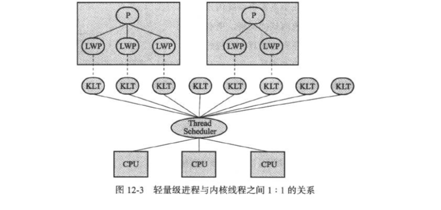

## Java线程

​		提到线程，免不了又要提到进程了。很多时候面试官经常会问的一个问题：线程与进程又什么区别？

​		**进程**是`os`资源分配的基本单位，所有与该进程有关的资源都会被记录在[PCB](https://baike.baidu.com/item/%E8%BF%9B%E7%A8%8B%E6%8E%A7%E5%88%B6%E5%9D%97)进程控制块中，以表示该进程拥有这些资源或正在使用他们呢。

​		**线程**是`os`能够进行运算调度的最小单位，它被包含在进程当中。在一个进程中的多个线程会共享进程中的资源以及内存（如文件描述符，虚拟地址空间等）。


### 简介

>  	线程是独立调度和分派的基本单位，线程可以分为`kernel`线程和`user`线程。线程可以共享进程的全部系统资源，但是在其内部存在自己的调用栈，寄存器环境，和本地线程存储。多线程之间往往存在竞争关系，在多线程的情况下，我们往往需要做同步。


### 线程的实现

>  	线程的实现主要有三种方式：使用`kernel`线程实现，使用`user`线程实现和使用`user`线程加轻量级进程混合实现。

#### 1. 使用内核线程实现

​		内核线程(Kernel-Level Thread,ELT)直接由操作系统内核支持的线程，这种线程由内核来完成线程切换，内核通过操纵调度器(Scheduler)对线程进行调度，并负责将线程的任务映射到各个处理器上。每个内核线程可以视为内核的一个分身这昂操作系统就有能力同时处理多件事情，支持多线程的内核就叫做多线程内核（Multi Thread Kernel）。

​		程序一般不会直接去使用内核线程，而是去使用内核线程的一种高级接口——轻量级进程(Light Wight Process , LWP)，轻量级进程就是我们通常意义所讲的线程，由于每个轻量级进程都由一个内核线程支持，因此只有先支持内核线程，才能有轻量级进程。这种轻量级进程与内核线程之间1:1的关系称为一对一的线程模型。



**优点：** 由于其一对一模型的特点，即使是一个轻量级进程，也就是线程发生阻塞，也不会影响整个应用程序的运行。还有其他的线程可以继续工作。

**缺点：** 其基于`os`内核实现的特性，导致所有与线程相关的操作都需要由`os`来参与。系统调用的代价相对较高，需要在用户态(User Mode)和内核态(Kernel Mode)中来回切换。由于用户线程都需要一个内核线程对应，相对而言比较消耗内内核资源（入内核线程的栈空间），因此限制了`os`对线程支持的数量。


#### 2. 使用用户线程实现

​		从广义上来讲，一个线程只要不是内核线程，都可以认为是用户线程(User Mode)，因此轻量级进程也属于用户线程，但是轻量级进程始终是建立在内核之上，许多操作都要进行系统调用，效率会收到限制。

​		从狭义上来讲，用户线程是指完全建立在用户空间的线程库上，系统内核不能感知到用户线程的存在。用户线程的建立，同步，销毁和调度完全依赖线程库在用户态来完成，不需要借助内核的帮助。


**优点：**不依赖`os`内核支持，线程不需要频繁的进行用户态到内核态，再从内核态到用户态到切换。减少了一定的开销。

**缺点：** 所有的线程相关的操作都需要应用程序自己处理，线程的创建，切换和调度都是要考虑的问题。而且`os`只把处理器资源分配到进程，`线程阻塞`,`线程映射到其他处理器`这类问题都很难解决。因此用户线程实现的程序一般都比较复杂。

#### 3. 使用用户线程加轻量级进程混合实现

​		混合实现中，既存在用户线程，也存在轻量级进程。用户线程独立在用户空间，线程的创建、切换、析构等操作依然低廉，并且合一支持大规模的用户线程并发。而`os`提供支持的轻量级进程则作为用户线程和内核线程的桥梁，这样可以使用内核提供的线程调度功能及处理器映射，并且用户线程的系统调用要通过轻量级线程来完成，大大降低了整个进程被完全组阻塞的风险。用户线程与轻量级进程的比例为N：M。即多对多线程模型。


**优点：** 采取这种混合模式，可以一定程度上节约`os`的资源，简化了用户线程的处理，将比较难的部分，处理器的映射和线程阻塞交给`os`处理。用户线程数量不再受限于`os`的资源数量。

**缺点：** 用户线程还是需要进行一定切换开销，部分核心功能还是依赖`os`内核态的线程完成，一定程度上还是受限于内核的资源数量影响。


**Java线程的实现**

​		目前Java采用的是一种线程模型实现。


----

### Java线程的调度

​		线程调度是指系统为线程分配处理器使用权的过程，主要的调度方式分为协同式线程调度(Cooperative Threads-Scheduling)和抢占式线程调度(Preemptive Threads-Scheduling)。

#### 协同式线程调度

​		线程的执行时间由线程本身来控制，线程把自己的工作执行完之后，要主动通知系统切换到另外一个线程上。协同式多线程最大的好处是实现简单，而且由于线程需要把自己的事情干完才会切换，切换是主动，不存在线程竞争，因此也就不需要处理线程同步。缺点显而易见，线程的执行时间不受控制，如果一个线程的执行时间过长，或者直接被阻塞。那么其他线程将永远无法得到调用的机会。可能的话，还会导致整个系统的崩溃。

#### 抢占式线程调度

​		线程的执行时间由`os`来分配执行时间，线程的切换由`os`决定(Java中可以使用Thread.yield()让出CPU)。这种实现线程调度方式下，线程的执行时间是可控的，也不会有一个线程导致整个进程阻塞的问题。当一个进程出现问题时，还可以使用任务管理器将此进程`kill`掉。从而避免整个`os`崩溃。

***Java采用的抢占式调度方式。***


##### Java内部线程的优先级

​		Java线程在内部设置了10个线程优先级，为了满足一些特定的需求，比如：需要制定特定线程多运行一些时间，或者优先执行。而有些线程则少占用CPU时间。在内部采用`1~10`来表示线程的优先级，数越大，表示优先级越高，默认情况下是`Thread.NORM_PRIORITY = 5`，当然这只是给`os`的建议，真正的执行情况还是需要`os`来决定。

​		**注意：**通常情况下，我们不建议去主动设置线程优先级，因为这种优先级并不靠谱，这只是Java语言中规定的等级规范，但是不同的`os`内部的线程优先级各不相同，当`os`当线程优先级数量比Java多还好说，直接舍去多那部分即可，但是有些`os`（Window 7种）支持多优先级可能比Java少，那么多的部分将会被映射为同样优先级，这样可能会给程序带来一定困惑。不仅如此，`os`可能会主动改变线程的优先级，这也是一种优化手段，此时我们手动设置的优先级讲失去效果。

---

### 线程的几种状态

​		此处叙述的仅仅是Java中的线程模型。在JDK1.5中明确的提出了Java线程的状态类型（[State](https://docs.oracle.com/javase/8/docs/api/java/lang/Thread.State.html)），总共有6种:

- NEW （新建） 表示线程被创建还没被启动，此时仅仅只是表示为一个Java对象。
- RUNNABLE （就绪） 表示该线程已经在线程种执行，此时其实包含了两种隐含的状态（**running or ready**）,kennel在运行，也可能是就绪状态，调用start()方法后，线程不会立即执行，而是需要等待系统轮训分配CPU片段，此时它就是`running`状态，否则它将在就绪(ready)队列中排队等待。
- BLOCKED （阻塞） 阻塞状态，表示线程正在等待`Monitor lock`。当多个线程竞争锁的时候，未获取到锁的线程将进入阻塞状态。
- WAITING （等待）表示正在等待其他线程采取某些操作，此时不会被分配CPU执行时间。经典的场景就是生产者->消费者模型。发现当前的条件不满足，即等待条件满足再继续执行。一般是需要释放信号量来接触等待状态。Thread.join()指令就可以让线程进入等待状态。
  - 没有设置Timeout参数的Object.wati()方法
  - 没有设置Timeout参数的Thread.join()方法
  - LockSupport,park()方法
- TIMED_WAITING （超时等待） 表示当线程进入等待状态后，等待一定时间如果还没有人唤醒自己，那么它将自动解除等待状态（OS唤醒）。这种状态也不回被配粉CPU执行时间。
  - Thread.sleep()方法
  - 设置Timeout参数的Object.wati()方法
  - 设置Timeout参数的Thread.join()方法
  - LockSupport.parkNanos()方法
  - LockSupport.parkUntil()方法
- TERMINATED （终止） 表示线程生命周期结束，不管是异常退出还是正确执行完成。


上图粗略的表示了各个状态之间的转换关系。


#### 线程的常见问题

1.  Thead.start()调用两次会发生什么？

   Java线程是不允许启动两次的，第二次调用会抛出`IllegalThreadStateException`，这是一种运行时异常。观察线程的生命周期，当调用`start（）`后，正式进程了线程的生命周期，从`new->runnable`。一旦线程启动，将无法回退到`new`状态。

2.  当线程的生命周期开启时，那些因素可以影响到线程状态?

   - 线程自身的方法，除了start外，还有多个join方法，等待线程结束。yield告诉调度器主动让出CPU。
   - Object提供了一些基础的wait/notify/notifyAll方法，如果我们持有每个对象的Monitor锁，调用wait会让当前线程处理等待状态，知道其他线程notify/notifyAll。所以本质上是提供了Monitor的获取和释放能力，是基本的线程间通信方式。
   - 并发类库中的工具，比如CountDownnLatch.await()会让当前线程进入等待状态，知道latch被计数为0，这可以看作是线程间通信的`Signal`

3.  信号量丢失&虚假唤醒

    多核CPU系统中，线程等待存在一种可能，就是在没有任何线程发出广播或者发出信号量多情苦下，线程就被唤醒。还有一种情况就是线程发出了唤醒信号量，但是被丢失了。这样可能导致等待的线程将永远等待。

   ```java
   // 推荐
   while(isCondition()){
     waitForAction(...);
   }
   
   // 不推荐，可能存在Bug
   if(isCondition()){
     waitForAction(...);
   }
   ```

   

4. 