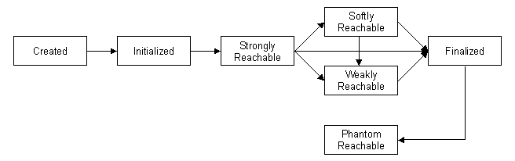

## Java对象的生命周期


> ​	Java语言除了原始数据类型外，还有一种类型被称之为引用类型。对象的创建一般需要使用`new`关键字，将创建的对象存储在堆上`(heap)`。而在线程栈中会保留一个指向堆上地址的引用。


下图将展示堆栈之间的具体关系，栈中被分割成一个一个的栈帧("frames")，其中包含调用树中每个方法的参数和局部变量。


当实例化一个对象是，如果是一个`Integer`对象，那么JVM首尝试为此对象找到足够的堆空间 - 在32位JVM上大约12个字节。如果可分配的空间足够，那么就调用构造函数，初始化新分配的对象。最后，JVM在bar变量中存储一个指向该对象在堆内的一个内存地址。


当然这是最好的情况，但是有可能，在执行`new`操作时，JVM无法寻找到一个合适的空间，那么JVM首先会调用GC（垃圾回收机制）来腾出一部分空间，但是如果还是无法满足创建对象的要求，那么JVM不得不抛出`OutOfMemoryError`异常并放弃对象的创建。


**Garbage Collection**

GC（垃圾回收机制）是Java管理对象生命周期的重要组成部分，在Java中你创建对象可以使用`new`关键字来处理，但是Java中没有提供与之对应的`delete`关键字来处理对象的销毁操作。这就使得我们的应用程序存在内存耗尽的风险。Java为了避免开发者滥用对象的销毁操作，提供了`GC`机制，即对象的销毁操作由JVM来自己管理，这样可以帮助开发者，从频繁的对象销毁处理操作中解放出来。

当程序试图创建一个新对象并且堆中没有足够的空间时，垃圾收集器开始工作。当收集器查看堆时，请求线程被挂起，尝试查找程序不再使用的对象，并回收它们的空间。如果收集器无法释放足够的空间，并且JVM无法扩展堆，则`new`运算符将因OutOfMemoryError而失败。通常会关闭您的应用程序。


**Mark-Sweep**

垃圾收集的大致分为两种：`引用计数`和`扫描标记`。

- 引用计数  每次对对象的引用都会使对象的引用次数+1，当对象的引用次数为0时，即代表该对象没被引用，即可以通知GC进行垃圾回收。但是存在一个缺点就是，无法避免循环引用，当A中引用B,B中引用A时，这部分内存将无法被回收。
- 扫描标记  JVM认为无法访问的对象都是垃圾（不可达对象），可以被GC回收。 JVM会从一个`root`引用对象开始，遍历对象图标记它能到达的对象，这杯称之为标记。

哪些对象引用可以被称之为`root`？

- stack 存储在栈中的包含方法参数，方法内局部变量，当前正在执行的操作表达式
- heap 静态类成员变量


**Finalizers**

 	虽然在Java中并没有提供类似C++那样的析构函数，但是Java提供了一个`终结的方法`，这个方法会在对象进行垃圾回收之前进行调用，我们可能会想，GC不是帮我们回收了对象的内存，为什么还要调用`finalize`。要知道，在我们的应用程序中，内存并不是唯一的资源，还有一些其他的资源，比如socket连接，数据库连接，文件句柄的释放。当然还有一些其他的类似调用本地方法时，有时候，我们可能需要使用`malloc`来开辟一段内存空间，但是没用显示的调用`free`，Java是无法处理这些外部内存的。这时`finalize`就派上用场了，可以在`finalize`里面显示处理这些资源的释放操作。

**注意：** 你可能认为`Finalizers`是一个简单方便的资源清理工具，但是这可能会出现严重的问题，`Finalizers`的调用时机并不确定，我们无法决定系统何时来调用`Finalizers`，因为GC的触发是由JVM来决定。它有可能永远也不触发，当GC还没触发我们的应用程序就退出了，你不敢想象这样会发生什么样的问题。所以，我们针对一些资源的释放，我们尽力显示调用，而不要等到对象销毁时，再处理。可以继承`AutoClose`接口来处理资源的释放。


### 对象的生命周期(旧)

简而言之，我们可以采用一张图片来概括：


**对象创建-》初始化-》被使用-》不可达-》被收集**

前面的部分，表示对象`强可达`的时间。


### 对象的生命周期(新)

在JDK1.2中引入了[java.lang.ref](http://java.sun.com/javase/7/docs/api/java/lang/ref/package-summary.html)包，内置对象的三个新生命周期：

- 强可达(Strongly Reachable)  当一个对象可以有一个或多个线程可以不通过各种引用访问到的情况，比如我们新创建一个对象，那么创建它的线程对它就是强可达。

- 软可达(Softly Reachable)   如果一个对象不是强可到达对象，但通过遍历某一软引用可以到达它，则该对象是软可到达 对象。
- 弱可达（weakly Reachable） 如果一个对象既不是强可到达对象，也不是软可到达对象，但通过遍历弱引用可以到达它，则该对象是弱可到达 对象。当清除对某一弱可到达对象的弱引用时，便可以终止此对象了。
- 幻想可达（Phantom Reachable）如果一个对象既不是强可到达对象，也不是软可到达对象或弱可到达对象，它已经终止，并且某个虚引用在引用它，则该对象是虚可到达对象。
- 不可达（Unreachable） 当不能以上述任何方法到达某一对象时，该对象是*不可到达* 对象，因此可以回收此对象。




#### 强引用("Stong" Reference)

​		强引用在我们的引用程序中，随处可见，就是普通对象的引用，只要我们持有这个引用，并且被引用的对象还存在，就表示对象还存活，也就是在可达性分析中，可以从`root`对象搜索到该对象。垃圾收集器并不会收集该对象。对于普通对象，如果没有其他的引用关系，只要超过了的引用作用域或者显示的赋值为`null`，表示该对象可以被垃圾收集器收集了。

​		这里需要强调两点，第一是：在一般情况下，我们调用方法都会在内部声明一些局部变量或提供一些入口参数，一旦这些方法调用结束，即代表着超出了引用的作用域，那么即代表失去了`root`，对象将有可能变得不可达。第二是：如果显示赋值为`null`，则表示被引用的对象，与持有对象引用的变量之间失去联系，没有变量再指向该对象，也变得不可达。


#### 软引用("Soft" Reference)

 		弱引用比强引用相对弱化一些，可以让对象豁免一部分的垃圾收集。如果一个referent 是一个软引用并且没有被强引用时，当JVM认为内存不足时，才会尝试回收这些软引用指向的对象。JVM提供的保证是，在抛出`OOM`之前，清理这部分引用的对象。但是，当JVM能恢复到足够的内存时，变不会再清除这部分内存了，因此一个软引用对象可以在`一次`甚至是`多次`的垃圾回收中幸存。

​		JDK文档明确指示，软引用通常用来实现内存敏感的缓存，如果还有空闲内存，就可以暂时保留缓存，当内存不足时再清理掉部分缓存，这样即可以避免内存被耗尽，也可以使缓存可用。

​		软引用在`Android`中作为`bitmap`缓存应用得比较广泛。还有一个应用是，作为`断路器`，试想一下，当你从某处获取数据，比如数据库或者本地文件中，一次性加载全部的数据，这样有可能导致`OutOfMemoryError`。我们可以持有一个数据的软引用避免`OOM`。


#### 弱引用(“Weak” Reference)

​		弱引用并不能豁免垃圾收集，仅仅提供一种访问在弱引用状态下的对象途径，如果没有对referent 的强引用或软引用，它几乎可以保证被收集。它有两个主要的用途：关联没有固定联系的对象，`通过规范化Map`（ canonicalizing map.）消除重复引用。

​		canonicalizing map是关联两个没有固定关系对象的有效手段。也就是维护一种非强制的映射关系，当你获取一个对象时，如果对象还存在就使用它，没有则重新实例化，并将其放入这个映射中。`String.intern()`就是一个该应用的经典实现，这样能有有效避免重复字符串消耗内存。而且并不依赖key,value 的映射关系，代表 同一个Key所映射的value是可变的，这种可变体现在，当value被内存回收后，会出现一个新的value来替代原来的value。而对于程序本身来说并没有什么大影响，除非你在比较value的hash值。


#### 幻像引用("Phantom" Reference)

​		幻像引用也被称作为虚引用或幽灵引用。你不能通过它来访问对象(referent )，因为它永远返回`null`，通过虚引用可到达的对象将仍然保持原状，直到所有这类引用都被清除，或者它们都变得不可到达。也就是虚引用一旦被引用，那么它的状态将无法被改变。它的唯一目的是告诉你他们的（referent ）何时被收集。但它实际上允许您执行资源清理，其灵活性比从终结器获得的更灵活。

​		灵活体现在哪里？

​		终结器的触发由JVM来调度，对于应用程序来讲，这代表着一种不可靠。虽然有一些`System.gc()`以及`System.runFinalization()`系统级别的API供开发者调用，但它是随机的，没有强制性的。而通过幻象引用，我们可以很方便的处理一些资源的释放，我们只需要开启一个或多个后台线程轮询引用队列进行清理。

​		比如：它可以用来做些`Post-Mortern`清理机制，以及`Clean机制`，还可以用来监控对象的创建和销毁。


#### 引用队列(ReferenceQueue)

​		ReferenceQueuen一般是与各种引用相关联的，我们在创建各种引用时可以显示的关联到对应的引用队列，JVM会在特定的时机将引用enqueue到队列，我们可以从队列中获取引用，然后进行处理。通过引用队列我们可以快速定位到哪些将被垃圾收集的对象，避免查询这些引用的开销。

ReferenceQueue一般会与幻象引用结合使用，因为幻象引用只能返回`null`,我们可以使用队列判断，幻象引用所引用的对象是否已经销毁，从而确定对象的生命周期。


#### Finalizers的问题

在前面，我们提到过不建议将资源的释放放在这里来做，因为它会存在下面两点问题：

- 可能永远无法被调用

  `Finalizers`的调用时机并不确定，我们无法决定系统何时来调用`Finalizers`，因为GC的触发是由JVM来决定。它有可能永远也不触发，当GC还没触发我们的应用程序就退出了，你不敢想象这样会发生什么样的问题。所以，我们针对一些资源的释放，我们尽力显示调用，而不要等到对象销毁时，再处理。可以继承`AutoClose`接口来处理资源的释放。

- 终结器可能会创建另外一个对象的强引用。

  可以将一个非强引用对象，重新指向到强引用对象。这相当于"复活了"对象。当垃圾收集器再次收集时，将不会再运行终结器。 这样带来的危害是可能某些在终结器中的释放操作并不会如期完成。

`Finalizers`的真正问题应该是在JVM首次将某些对象标记为可清理状态到内存实际回收之间存在一个间隙.`finalization`操作是运行在自己的现场也就是`Finalizer`的守护线程。并不依赖GC线程。GC会保证在进行`full GC`之前会返回`OOM`。如果所有可以被GC回收的对象都有`finalizers`，那么GC将变得不再有效，所以被标记的对象都会等待`finalize`都执行。

`Finalizers`由一个单线程的后台线程并长时间运行。如果在`finalize`方法中让线程休眠或阻塞会发生什么？

```java
public class SlowFinalizer
{
    public static void main(String[] argv) throws Exception
    {
        while (true)
        {
            Object foo = new SlowFinalizer();
        }
    }

    // some member variables to take up space -- approx 200 bytes
    double a,b,c,d,e,f,g,h,i,j,k,l,m,n,o,p,q,r,s,t,u,v,w,x,y,z;

    // and the finalizer, which does nothing by take time
    protected void finalize() throws Throwable
    {
        try { Thread.sleep(500L); }
        catch (InterruptedException ignored) {}
        super.finalize();
    }
}
```

上面的代码，是一个典型的应用。可以调整JVM堆大小，我们可以快速的发现JVM会抛出`OOM`。大量`finalize`等待执行，GC不能正常运转，这势必会导致内存溢出。


#### 可能存在内存泄漏


重新梳理一下对象引用的关联关系。

我们发现软引用弱引用都可以回退到强引用状态（比如赋值给`static`变量），对象有可能不会再弱引用，软引用等状态了，就会存在内存泄漏等风险。这也是一个内存泄漏的排查点。


#### 显示影响软引用垃圾收集

JVM内部是如何处理类似软引用这类的引用，并不非常明确。我们可以通过调整参数来影响软引用的垃圾收集。

软引用通常会在最后一次引用后，还能保持一段时间，默认值是根据剩余空间计算的，通过`-XX:SoftRefLRUPolicyMSPerMB`参数，我们可以以毫秒为单位.

```xml
-XX:SoftRefLRUPolicyMSPerMB=3000
```

剩余空间会受JVM模式影响。对于Client模式，根据当前堆堆空闲大小来计算，所以更倾向回收，而Server模式则是根据`-Xmx`堆最大内存来计算。

**诊断JVM引用情况**

可以使用如下的JVM参数输出日志信息：

```xml
-XX:+PrintGCDetails -XX:+PrintGCTimeStamps -XX:+PrintReferenceGC
```


#### 参考链接🔗

[**Java Reference Objects**]([http://www.kdgregory.com/index.php?page=java.refobj](http://www.kdgregory.com/index.php?page=java.refobj)) 

[Plugging memory leaks with soft references](https://www.ibm.com/developerworks/java/library/j-jtp01246/index.html)