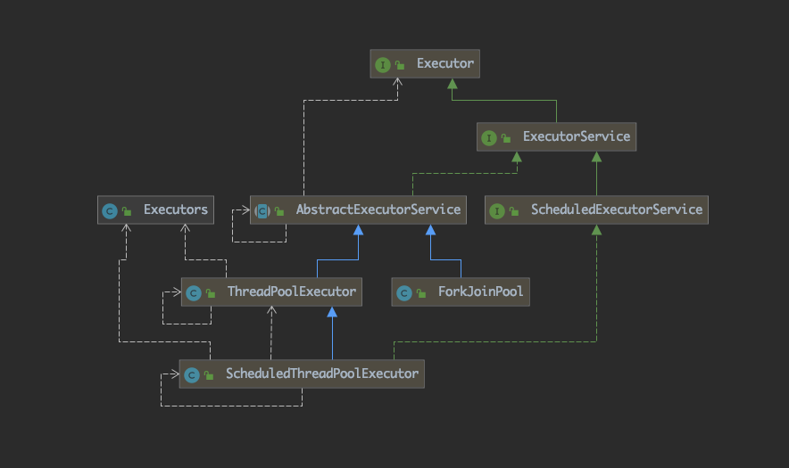
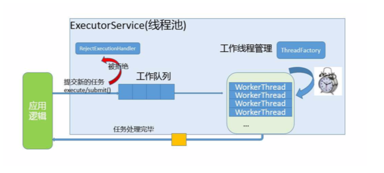
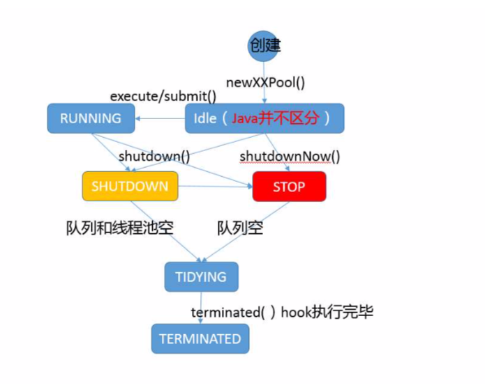
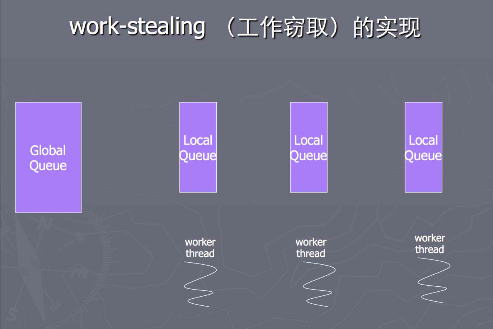
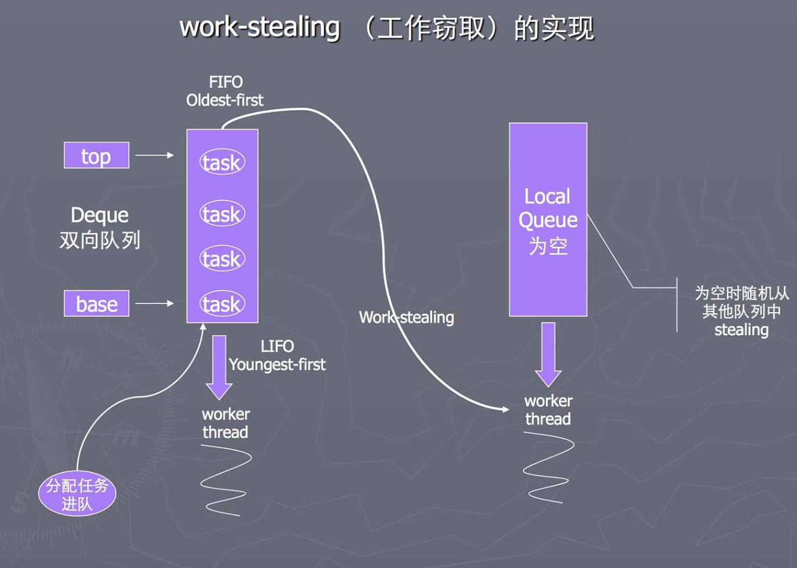

## 线程池

>  从字面义上来讲，是指管理一组同构工作线程的资源池。线程池是与工作队列密切相关的，其中在工作队列中(Worker Queue)保存了所有等待执行的任务。工作者(Worker)线程的任务很简单：从工作队列中获取一个任务并执行。执行完毕后，继续获取下一个任务。当队列为空时，等待执行。

---

### 优势

​		“在线程池中执行任务”比“为每个任务分配一个线程”有优势得多。

- 多个线程统一维护，方便管理。
- 将线程放在应用程序启动阶段，应用在服务端时可以减少创建线程的时间开销
- 使用池化的线程，可以达到线程复用的目的，线程执行完任务即放回线程池。避免了线程频繁的创建，销毁动作。有效节省`os`资源和`Thread`创建销毁开销。
- 可以降低处理延迟，当请求到达时，不需要等待线程的创建。
- 灵活的扩展，只需要调整参数即可达到调优的目的。
- 防止过多线程项目竞争资源而使应用程序耗尽内存。

---

### Executor

​		在线程的运行过程中，会分为两部分：线程和任务。任务通常会被抽象成`Runable`接口，它是一组逻辑的工作单元，而线程则是使任务异步执行的机制。传统的执行方式是创建一个线程，然后重写run方法，或者实例化一个Runable实例。使用Thread执行任务的策略大致分为两种：

- 把所有任务放在单个线程中串行执行
- 为每个任务分配一个线程

上述两者都存在一定的局限性：前者会降低程序的吞吐量，当某个任务执行时间过长时，后续任务将一直等待。这将造成一些执行时间较短的任务间接的增加了执行时间。而且在多核的CPU机器上，也达不到CPU的充分利用。 后者的话可以充分利用CPU资源，但是对于每个任务分配一个线程，这样很容易造成系统资源的枯竭。`os`的资源是有限的，每个线程都会维护两个执行栈，一个用于Java代码，一个用于原生代码。而JVM会给一个Java线程创建一个复合栈，大小约`0.5M`，那么一个`OS`可创建的线程资源紧紧只有几千到几万。对于高并发的场景来说，瞬间的请求过来会直接导致服务器停顿死机。而且CPU的数量远远小于线程数，多线程竞争资源会导致频繁的上下文切换。这样`os`的大部分时间都在处理线程竞争，从而降低程序的吞吐量。

​		JDK1.5内部提供了`Executor`接口，专门为执行任务抽象出来的接口。相比Thread的执行方式，它提供了更加灵活的执行策略。内部的`Executor`实现提供了对生命周期的支持，以及统计信息收集，应用程序管理机制以及性能监视等机制。

​		设计目的：这种设计的源于早起Java线程API的使用教训，开发者在实现应用逻辑时，被太多的线程创建、调度等不相关的细节所打扰。就像进行HTTP通信时，如果我们还去关注TCP的三次握手，四次回首，不仅开发效率低下，质量也难得到保证。

​	`Executor`内部提供了两种扩展抽象：

 	1. ExecutorService    普通的线程池（主要）
 	2. ScheduledExecutorService  专门用来处理定时任务的线程池，也是ExecutorService的扩展

   Java内部主要提供了三种类型线程池的实现:[ForkJoinPool](https://docs.oracle.com/javase/8/docs/api/java/util/concurrent/ForkJoinPool.html)、[ThreadPoolExecutor](https://docs.oracle.com/javase/8/docs/api/java/util/concurrent/ThreadPoolExecutor.html)、[ScheduledThreadPoolExecutor](https://docs.oracle.com/javase/8/docs/api/java/util/concurrent/ScheduledThreadPoolExecutor.html)

​	还提供了一个`Executors`方法来简化线程池的创建。

下图将展示一下线程池的类结构图：



---

### 线程池

​	在正式介绍线程池前，我们可以通过一张图来表示线程池的工作模式：



​		线程池中存在几个核心的概念参数：

- 工作队列(Worker Queue)  工作队列负责存储用户提交的各个任务，这个任务队列可以是[`BlockingQueue`](https://docs.oracle.com/javase/8/docs/api/java/util/concurrent/BlockingQueue.html)的子类。
- ThreadFacotry  线程工厂，负责创建执行的线程。我们可以自定义线程工厂的实现，为线程设置一些统一的参数，比如后台模式或者是线程ID。
- corePoolSize 核心线程数，代表线程池创建即启动的线程数目(除非是设置了allowCoreThreadTimeOut)，这些线程一般不会被回收，而是等待任务执行完毕后重新放入线程池，或者是从任务队列中获取下一个任务继续执行。
- maximumPoolSize 最大线程数，代表线程池中的核心线程数不够处理任务时(需要任务队列满)，会继续创建一些临时线程来处理任务，当任务执行完毕后，立即清除线程。最大值为(`Integer.MAX_VALUE`)。
- keepAliveTime&TimeUnit 这两个参数是一起存在的，前者指的超过核心线程数的那部分线程在空闲状态先最多能活的时间，后者是时间单位。
- RejectedExceptionHandler 拒绝策略，当任务队列饱和后，可以通过指定拒绝策略来处理后续添加的任务。拒绝策略有如下几种：
  1. Abort   终止策略，默认的拒绝策略。该策略将抛出`RejectedExcecutionExceptoion`。调用者可以捕获这个异常，自己处理。
  2. Discard  抛弃策略，当新提交的任务无法保存的任务队列时，该策略会将后续进来的任务丢弃掉。
  3. Discard-Oldest 抛弃最旧策略，最旧的表示队列首部的任务，该任务是下一个即将要执行的任务，它在队列中呆得最久。然后再重新尝试提交任务到队列。当任务队列是一个优先级队列(`PriorityBlockingQueue`)时，会按照优先级来丢弃优先级最高的任务。
  4. Caller-Runs  调用者运行策略，该策略是一种调节机制，它既不会丢弃任务，也不会抛异常。然是将某些任务回退到调用者，从而降低新任务的流量。它不会再线程池的某个线程中执行新提交的任务，而是在一个调用了`execute`线程中执行该任务。这种策略对于频繁提交任务的调用者来说，会导致任务一段时间不能被提交，程序吞吐性也将降低，大多数任务在等待调用者处理完这个任务。
  5. 自定义拒绝策略， 我们可以通过实现`RejectedExecutionHandler`接口来实现自己的处理逻辑。

#### 生命周期

​		JDK5中是给线程规定了六种生命周期(参见[Thread.State](https://docs.oracle.com/javase/8/docs/api/java/lang/Thread.State.html))，同样也给线程池定义了几种生命周期，具体的可以参照下图：



大致分为三种主要的生命周期：

- 运行   ExecutorService在创建时，并不会立即运行(Idel)。此时是空闲态的，当有任务提交到线程池时，此时才会慢慢的开启新的线程去真正执行。当开启的线程数达到corePoolSize，那么新来的任务才会加入到工作队列中等待执行。当队列满之后会启动新的线程(临时的)去执行任务队列中的任务。当任务线程池中的线程总数达到maximumPoolSize，此时开启拒绝策略。当然在线程池停止的情况下也会开启拒绝策略。
- 关闭 关闭状态分为两种，一种是调用`shutdown()`，此时线程池会平滑的关闭线程池，不会再接收新的任务，同时等待已经提交的任务完成-包括那些还未开始执行的任务。另外一种是：调用`shutdownNow()`，该方法比较粗暴，它将尝试取消所有运行中的任务，并且不再启动队列中未开始执行的任务。
- 已终止  线程池关闭后，等待所有任务执行完毕后。线程池进入终止状态。我们可以调用`awaitTermination`来等待ExecutorService进入终止状态，还可以调用`isTerminated`来轮询ExecutorService是否已经终止。两者联合使用可以达到同步关闭ExecutorService的效果。

ExecutorService提过如下几个API来帮助我们获取线程池状态：

```java
public interface ExecutorService extends Executor {
  void shutdown();
  List<Runable> shutdownNow();
  boolean isShutdown();
  boolean isTerminated();
  boolean awaitTermination(long timeout,TimeUtil unit) throws InterruptedException;
}
```

 **值得注意的是：shutdownNow会返回一个List列表，里面包含的是任务队列中未开始执行的任务**


#### Fork Join 框架

> Fork/Join并行方式是获取良好的并行计算性能的一种最简单同时也是最有效的设计技术。Fork/Join并行算法是我们所熟悉的分治算法的并行版本。

 Fork操作会将启动一个新的并行**fork/join**子任务，Join操作会一直等到所有子任务都结束。原理图如下：


为了高效的执行任务，Fork/Join采取工作窃取的工作模式。每个线程(工作者)不仅可以处理自己的任务队列，还可以从尾部窃取其他工作者的任务。

**工作窃取的实现**




**工作特点：**

1. push 和 pop只能被queue所有者线程调用。
2. Take 操作限制为每次只被一个stealing-thread使用。
3. 当dequeue为空时，pop和take方法都是有害的。
4. worker线程任务队列为空，并且偷不到其他队列的任务时后退，过会儿再重试，直到全部worker线程都同样空闲。

#### ScheduledThreadPoolExecutor&&Timer

​		ScheduledThreadPoolExecutor是扩展自ThreadPoolExecutor。负责周期性或定时地执行某些任务。在JDK不仅仅存在ScheduledThreadPoolExecutor作为定时器，还有一个[Timer](https://docs.oracle.com/javase/8/docs/api/java/util/Timer.html)可以作为定时器。但是Timer存在一些缺陷(Timer支持基于绝对时间而不是相对时间的调度机制，因此任务的执行对系统的时钟变化很敏感，而ScheduledThreadPoolExecutor只支持基于相对时间的调度)，通常更建议使用ScheduledThreadPoolExecutor作为定时器。

​		Timer主要的问题有两点：第一个是，Timer执行所有的定时任务时只会创建一个线程，如果某个任务执行时间过长，那么将破坏其他TimerTask(定时任务的抽象，所有的定时任务需要继承的类)的定时精确性。第二个是，如果TimerTask抛出一个未检测到异常，Timer不会捕获异常，此时Timer将被终止执行。它被认定为取消执行，且不能被恢复。那些已经被调度且尚未执行的TimeTask将不会再执行，新的任务也不能被调度。(这个问题被称之为"线程泄漏[Thread Leakage]") 

​		在ScheduledThreadPoolExecutor中能正确的处理这些异常。

#### 线程池的不可修改

​		为了防止使用者随意设置线程池的参数，线程池中提供了一种机制来保护定义的线程池。Executors中提供了两个静态内部类`FinalizableDelegatedExecutorService`和`DelegatedScheduledExecutorService`。它们是`ExecutorService`的一种实现，通过委托机制，在内部包装了一个`ExecutorService`。仅暴露了一些`ExecutorService`的实现方法。这样我们创建出来的`ExecutorService`，根据多态的定义，实际上是一个`DelegatedScheduledExecutorService和FinalizableDelegatedExecutorService`。用户无法强转型成`ThreadPoolExecutor或是ScheduledThreadPoolExecutor`。

​		除此之外，Executors中还提供了两个方法，将线程池变成不可变线程池

```java
    public static ScheduledExecutorService unconfigurableScheduledExecutorService(ScheduledExecutorService executor) {
        if (executor == null)
            throw new NullPointerException();
        return new DelegatedScheduledExecutorService(executor);
    }

    public static ExecutorService unconfigurableExecutorService(ExecutorService executor) {
        if (executor == null)
            throw new NullPointerException();
        return new DelegatedExecutorService(executor);
    }

```


---

### Executors

​		`Executors`是一个创建线程池的静态工厂方法，提供了如下几个创建方法：

 1. newFixedThreadPool(int nThreads)   创建一个固定长度(nThreads)的线程池，每当提交某个任务时就创建一个线程，直到达到线程池的最大数量，这时线程池的规模将不再变化（如果某个线程由于发生了未预期的Exception而结束，那么线程池会补充一个新的线程）。它在背后使用的无界工作队列(2<sup>31</sup>-1)，当任务到达时没有空闲线程，那么就会进入工作队列等待空闲线程出现。

    ```java
       public static ExecutorService newFixedThreadPool(int nThreads) {
            return new ThreadPoolExecutor(nThreads, nThreads,
                                          0L, TimeUnit.MILLISECONDS,
                                          new LinkedBlockingQueue<Runnable>());
        }
    ```

 2. newSingleThreadExecutor()  是一个单线程的Executor，它创建单个工作者线程来执行任务，如果这个线程异常结束，则会创建一个新的线程代替。它在背后同样适用的无界工作队列(2<sup>31</sup>-1)，它能保证任务的顺序执行，但是它比较特殊的是不允许使用者修改线程池的配置。

    ```java
       return new FinalizableDelegatedExecutorService
                (new ThreadPoolExecutor(1, 1,
                                        0L, TimeUnit.MILLISECONDS,
                                        new LinkedBlockingQueue<Runnable>()));
    ```

 3. newCachedThreadPool() 创建一个可缓存的线程池，如果线程池的当前规模超过来处理需求时，那么将会瘦空闲的线程，当需求增加时，则可以添加新的线程，线程池的规模不存在任何限制(2<sup>32</sup>)。它经常会被用来处理大量短时间工作任务。它有几个特点：缓存线程并冲用，当没有线程时重新创建。当线程的闲置时间超过60秒时，被终止并移除缓存。内部使用的是SynchronoursQueue同步队列为工作队列。

    ```java
    public static ExecutorService newCachedThreadPool() {
            return new ThreadPoolExecutor(0, Integer.MAX_VALUE,
                                          60L, TimeUnit.SECONDS,
                                          new SynchronousQueue<Runnable>());
    }
    ```

 4. newSingleThreadScheduledExecutor()和newScheduledThreadPool(int corePoolSize) 创 hi 安的ScheduleExecutorService，可以进行定时或者周期性的工作调度，类似Timer。跟newSingleThreadExecutor有点类似的是newSingleThreadScheduledExecutor()创建的定时任务线程池同样不能修改线程池的配置。

    ```java
    public static ScheduledExecutorService newSingleThreadScheduledExecutor() {
            return new DelegatedScheduledExecutorService
                (new ScheduledThreadPoolExecutor(1));
    }
    ```

    ```java
    public static ScheduledExecutorService newScheduledThreadPool(int corePoolSize) {
            return new ScheduledThreadPoolExecutor(corePoolSize);
    }
    ```

 5. newWorkStealingPool(int parallelism) 该线程池是在JDK8时才加入进来的，内部会构建`ForkJoinPool`线程池，该线程池是一个并行计算池，在JDK7中引进的。它采用的[Work-Stealing](https://en.wikipedia.org/wiki/Work_stealing)算法来处理任务队列。任务的执行是不保证顺序的。创建时可以指定线程个数，也可以不指定，默认情况使用`OS`的可用处理器数量。它的特点是，每个线程都会维护一个双端队列(Dequeue)，且线程间的队列互不影响。队列拥有者会从头部取队列任务运行，其他线程当自己的队列没有任务时，可以去从其他线程的尾部抓取任务(窃取)运行，从而达到高效运行的目的。

    ```java
        public static ExecutorService newWorkStealingPool(int parallelism) {
            return new ForkJoinPool
                (parallelism,
                 ForkJoinPool.defaultForkJoinWorkerThreadFactory,
                 null, true);
        }
    ```

    


### 参考

[Java Fork Join框架 (三) 设计](http://ifeve.com/a-java-fork-join-framework-3-2/)

[Doug Lea Fork Join论文](http://gee.cs.oswego.edu/dl/papers/fj.pdf)

[Java并发编程实战](https://book.douban.com/subject/10484692/)