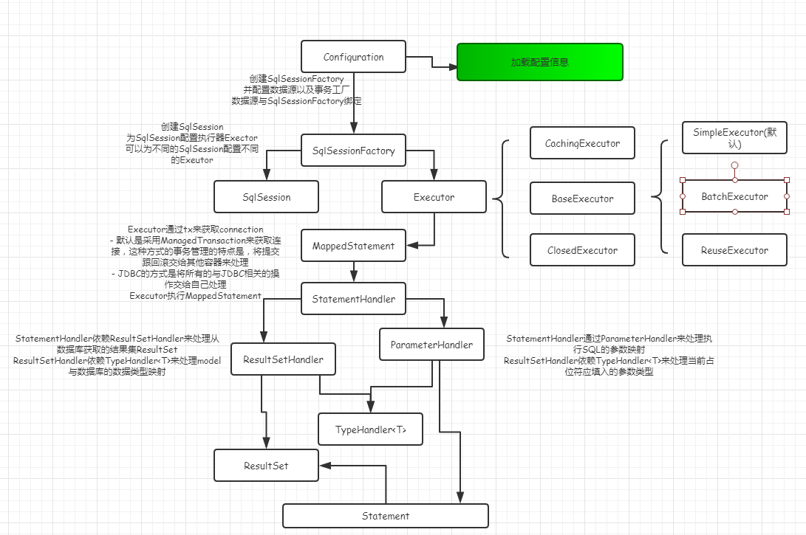
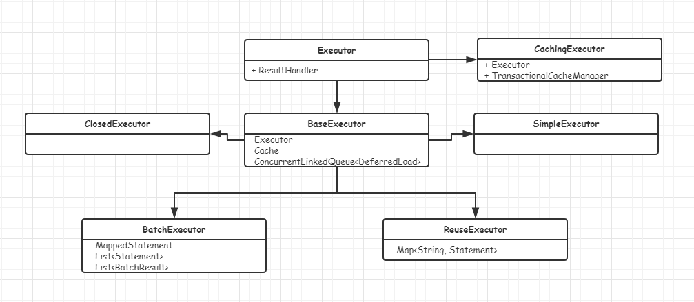
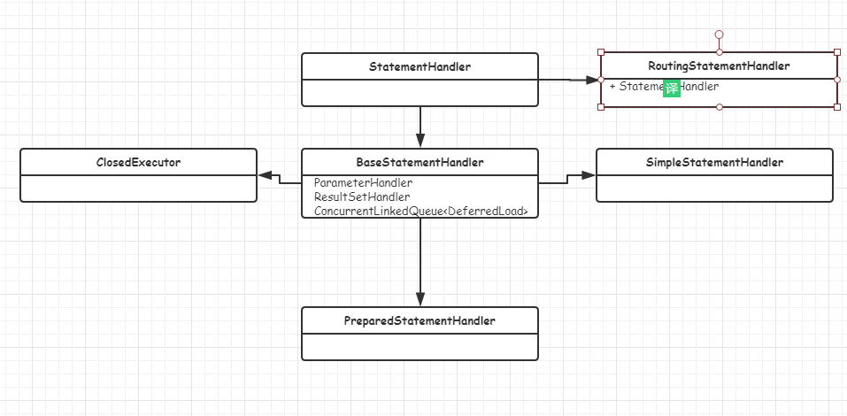
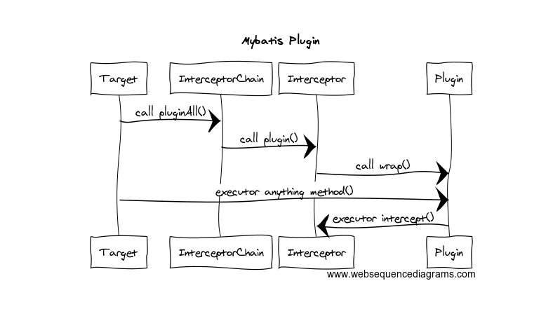
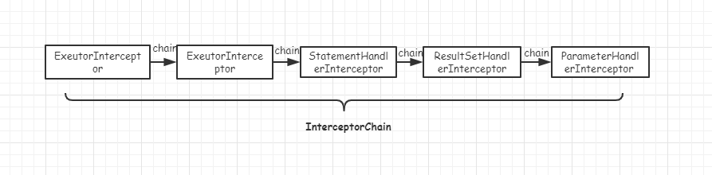
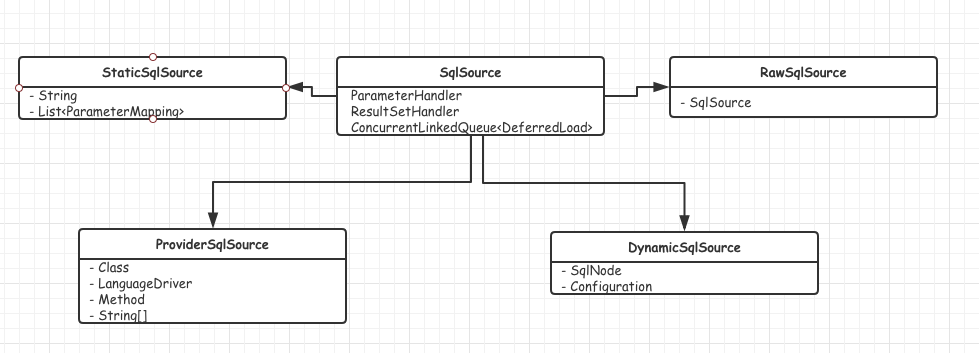
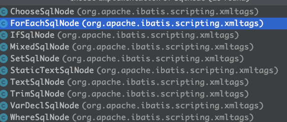

# 																													MyBatis解析


## 简介

> ​	[Mybatis](<http://www.mybatis.org/mybatis-3/zh/index.html>) 是一款优秀的持久层框架，它支持定制化 SQL、存储过程以及高级映射。MyBatis 避免了几乎所有的 JDBC 代码和手动设置参数以及获取结果集。MyBatis 可以使用简单的 XML 或注解来配置和映射原生类型、接口和 Java 的 POJO（Plain Old Java Objects，普通老式 Java 对象）为数据库中的记录。

- GitHub地址[Mybatis](<https://github.com/mybatis/mybatis-3>)


## 解决的问题

1. 从繁琐的代码结构中解脱，开发者关注的重点移动到了SQL的编写与优化上
2. 能够帮我们自动处理Java数据类型与数据库字段类型的映射关系
3. 可以轻易的与其他框架整合，将整合的任务交给Mybatis自己处理
4. 动态SQL，可以使少量的SQL片段，处理大多数的SQL逻辑

## 工作流程图




---

## 核心组件

> ​	在Mybatis中存在四个比较核心组件，分别是`Executor`、`ResultSetHandler`、`StatementHandler`、`ParameterHandler`。它们作用整个Mybatis的运行周期。即，每次访问数据库都会经过这有这几个组件的参与。

- Executor 执行器
- ResultSetHandler 结果集映射处理器
- StatementHandler  Statement处理器
- ParameterHandler 参数映射处理器

### Executor

> Executor的作用主要有以下几点：
>
> - 开启数据库连接，获取connection
>
> - 缓存执行结果，一级缓存(二级缓存，Configuration上的Map<String,Cache>)
> - 维持懒加载队列，实现结果集的懒加载
> - 绑定事务
> - 记录执行上下文

下面是`Executor`的`UML`类图

 

​	由Executor总共衍生出6个类来，其中`CachingExecutor`使用的`装饰者模式`，处理查询缓存的，如果查询的`MappedStatement`使用了缓存，并且缓存存在，那么直接从缓存中`load`结果，可以提高查询效率。这就是一级缓存，同一个`SqlSession`范围内有效。

#### BaseExecutor

​	这是一个`Executor`的基类，开启事务，处理connection，获取Sql，创建CacheKey，CacheKey的作用是为每个缓存的主键，每个缓存结果对应一个CacheKey.记录执行上下文`ErrorContext`。

​	在`BaseExecutor`中还存在着一个`本地缓存`的概念，这个主要用于查询的结果集的嵌套映射，比如A中有B，B中有A，那么通过本地缓存可以有效的解决依赖循环的问题，避免无限循环的查询数据库。在BaseExecutor中帮我们处理了大量的抽象逻辑，将增删改差的部分，交给剩下的子类去完成自己特定的逻辑。它的子类主要三类逻辑：

 - SimpleExecutor（默认）

   一种简单执行处理器，仅仅调用一些其他的组件，如StatementHandler来处理执行语句返回结果。每次执行都会创建一个新的Statement。

 - BatchExecutor

   它也支持批处理执行，在BatchExecutor内部维持着，两个List集合`statementList`，`batchResultList`用于存储执行的Statement,一个用于存储单个语句的结果集，它的执行阶段不再`doUpdate`阶段，而是在`doFlushStatements`阶段。`doFlushStatements`阶段执行就是遍历`statementList`依次执行，将求得的结果集装入`batchResultList`中。

 - ReuseExecutor

   这是一个可复用的执行器，除了SimpleExecutor的功能外，内部位置一个Map，缓存每次执行的Statement，如果执行的SQL之前执行过，那么直接返回之前的Statement，不用每次开关Statement，可以有效提升`执行`效率。。也是在SqlSession返回内生效，当SqlSession声明周期结束，关闭所有缓存的Statement。

   **注意：** 这里缓存的不仅仅是查询，更新操作也可以缓存，因为它缓存的预处理的SQL语句，而不是结果集，像有些动态SQL，解析过程也是十分耗时所以，使用该模式的执行器，可以提升一定程度上的执行效率。

   以下是它判断是否使用缓存的逻辑：

   ```java
   return statementMap.keySet().contains(sql) && !statementMap.get(sql).getConnection().isClosed();
   ```

---

### StatementHandler

> ​	Executor的调用往往是交给StatemenHandler来处理的，Executor的侧重点主要在于缓存，以及整个连接的上下文处理。而StatemenHandler的职责主要用来处理SQL，它同`ResultSetHandler`，`ParameterHandler`协作处理SQL，它主要由如下几个功能：
>
> - 设置Statement的基本属性，例如timeout，fetchSize等
> - 处理主键策略前置逻辑

下面是`StatementHandler`的`UML`模型图：



​		

​		这里的设置模式跟Executor如出一辙，不过这里的`RountingStatement`采用了路由的概念，内部通过一个`delegate`来委托真正的实现着去完成对应动作，它的核心逻辑知识通过`switch`做路由分发。

​		核心逻辑代码：

```java
 switch (ms.getStatementType()) {
      case STATEMENT:
        delegate = new SimpleStatementHandler(executor, ms, parameter, rowBounds, resultHandler, boundSql);
        break;
      case PREPARED:
        delegate = new PreparedStatementHandler(executor, ms, parameter, rowBounds, resultHandler, boundSql);
        break;
      case CALLABLE:
        delegate = new CallableStatementHandler(executor, ms, parameter, rowBounds, resultHandler, boundSql);
        break;
      default:
        throw new ExecutorException("Unknown statement type: " + ms.getStatementType());
    }
```


#### BaseStatementHandler

​	BaseStatementHandler是一个StatementHandler的基类，它的只能是获取Statement,设置Statement，并执行相应的主键策略的`前置处理`。内部细节由下面的子类来完成。它有如下三个子类：

- SimpeStatementHandler

  获取Statement，使用Statement直接执行静态SQL，不包含占位符，这种模式可能存在SQL注入的危险。

- PerparedStatementHandler(默认)

  获取PreparedStatement，并调用`parameterHandler`来处理参数的注入，使用PreparedStatement来执行SQL，包含占位符。

- CallableStatementHandler

  支持存储过程的处理器。对存储过程不太了解。。。。

---

### ParameterHandler 

> ​	ParameterHandler 只有比较简单，只有一个默认的实现，它内部搭配`TypeHandlerRegistry`来处理参数的映射，`TypeHandlerRegistry`是一个类型注册中心，内部主要维持着Java类型与数据库中类型的映射关系的处理器(`TypeHandler`)。

---

### ResultSetHandler

> ​	ResultSetHandler也比较简单。内部也只有一个默认实现，内部也是搭TypeHandlerRegistry来处理结果参数的映射，然后封装对应的Model返回给调用者。


----


## 拦截器（plugins）

> ​	拦截器也是Mybatis中一个比较核心的功能，很多的第三方插件都是依赖拦截器的功能来实现的。Mybatis中支持的拦截的拦截点有四处：`Executor`、`ResultSetHandler`、`ParameterHandler`、`StatementHandler`，可以拦截上述接口的所有方法。

核心类`InterceptorChain`，内部维持一个`Interceptor列表`，列表中就是拦截器，下面表示所支持的方法：

- Executor (update, query, flushStatements, commit, rollback, getTransaction, close, isClosed)
- ParameterHandler (getParameterObject, setParameters)
- ResultSetHandler (handleResultSets, handleOutputParameters)
- StatementHandler (prepare, parameterize, batch, update, query)

### 如何实现一个拦截器

​		实现一个拦截器，你需要做三步步操作：

1. 实现Interceptor接口

2. 添加签名注解

   ```java
   @Intercepts({@Signature(
     type= Executor.class,
     method = "update",
     args = {MappedStatement.class,Object.class})})
   ```

   - type　拦截对象
   - method 需要拦截的方法
   - args　参数列表，通过参数类别可以识别重载的方法（一定要跟拦截方法的参数类型一致）

   一个完整的例子（摘抄自官网）：

   ```java
   // ExamplePlugin.java
   @Intercepts({@Signature(
     type= Executor.class,
     method = "update",
     args = {MappedStatement.class,Object.class})})
   public class ExamplePlugin implements Interceptor {
     public Object intercept(Invocation invocation) throws Throwable {
       return invocation.proceed();
     }
     public Object plugin(Object target) {
       return Plugin.wrap(target, this);
     }
     public void setProperties(Properties properties) {
     }
   }
   ```

   上面这个例子，在执行Executor的更新操作之前，会经过这个方法。

3. 让Mybatis初始化的时候识别拦截器

   如果你使用的xml那么可以像如下这样：

   ```xml
   <plugins>
       <!--填上类的全限定名-->
     <plugin interceptor="org.mybatis.example.ExamplePlugin">
       <property name="someProperty" value="100"/>
     </plugin>
   </plugins>
   ```

   如果你使用的SpringBoot那么你可以直接在拦截器上面加上`@Component`注解

#### 拦截器的执行流程



拦截器的设计主要采取的是：责任链+jdk动态代理来实现拦截效果。

**责任链**



​		上面展示的就是Mybatis中责任链的模型，将所有Interceptor绑定在一条链上，一次执行。

**动态代理**

​		MyBatis采用JDK内置的代理技术来实现切面，`Plugin`实际上就是实现代理的类。真正实现拦截功能。

**如何判断拦截的类呢？**

​		首先通过反射性获取被代理类（target）上所有的执行方法，然后扫描`interceptor`上的注解信息，然后获要执行的方法。当target方法被执行时，会将被执行的方法与target加上参数一起封装成一个`Invocation`对象传递给`interceptor`，`interceptor`执行完自己的逻辑后，再处理`invocation`，实际上就是执行原来的方法。从而实现代理的功能。

---

## SQL的生成

> ​	在目前的MyBatis版本中提供了多种生成SQL的方式，大致分为如下几种：
>
> - 从XML配置文件中读取
> - 使用注解从接口上获取SQL
> - 基于Provider的方式，指定类+方法名来生成对应的SQL语句

​		在Mybatis中获取SQL的接口是`SqlSource`，通过将用户传入的参数，以及mapper.xml文件来解析出BoundSql对象，BoundSql就是预处理的SQL。

​		下面将展示一下`SqlSource`的UML：



​		在上面的类图大致分为两种类型的SQL:	

- 动态SQL
- 静态SQL

#### 静态SQL

​		RowSqlSource与StaticSqlSource就是用来生成静态SQL的，RawSqlSource是StaticSqlSource的一层装饰器，用来增强StaticSqlSource。帮StaticSqlSource处理了占位符标签里面的内容`#{xx,jdbcType=INTEGER,javaType=Integer}`，以及封装参数映射列表`List<ParameterMapping>`。当真正执行SQL处理的时候，可以借助这个列表来找到对应的参数设置位置。StaticSqlSource的主要就是传递一些上下文信息给BoundSql。执行到这里已经获取到了静态的SQL，剩下的问题在于参数的注入了。


#### 动态SQL

​		动态SQL的特点在于，当你真正执行SQL的操作的时候，它才会去解析那些动态的标签例如(<if><foreach>,<choose>)等等。因此，执行效率上，明显要低。

​		动态SQL中存在一个`SqlNode`的抽象，它针对不同的动态标签处理都有独立的实现。



​	上面有个`MixedSqlNode`，这是一个SqlNode的集合。动态SQL的解就是依赖MixedSqlNode来解析动态标签，结合用户传入的参数，然后通过标签解析器来实现sql片段的生成。最后将生成的片段使用`DynamicContext`追加拼接起来。


#### 如何判断是否为动态SQL？

​		在内部会通过解析语法树来判断，在初始化的时候会维持一个标签处理Map，当遇到的解析标签在Map中存在，那么直接添加到List<SqlNode>中。然后传递给DynamicSqlSource。在真正执行的时候再去依赖SqlNode解析最终的Sql。

​		解析逻辑代码：`XMLScriptBuilder`

```java
 		nodeHandlerMap.put("trim", new TrimHandler());
    nodeHandlerMap.put("where", new WhereHandler());
    nodeHandlerMap.put("set", new SetHandler());
    nodeHandlerMap.put("foreach", new ForEachHandler());
    nodeHandlerMap.put("if", new IfHandler());
    nodeHandlerMap.put("choose", new ChooseHandler());
    nodeHandlerMap.put("when", new IfHandler());
    nodeHandlerMap.put("otherwise", new OtherwiseHandler());
    nodeHandlerMap.put("bind", new BindHandler());
```

```java
protected MixedSqlNode parseDynamicTags(XNode node) {
    List<SqlNode> contents = new ArrayList<>();
    NodeList children = node.getNode().getChildNodes();
    for (int i = 0; i < children.getLength(); i++) {
      XNode child = node.newXNode(children.item(i));
      if (child.getNode().getNodeType() == Node.CDATA_SECTION_NODE || child.getNode().getNodeType() == Node.TEXT_NODE) {
        String data = child.getStringBody("");
        TextSqlNode textSqlNode = new TextSqlNode(data);
        if (textSqlNode.isDynamic()) {
          contents.add(textSqlNode);
          isDynamic = true;
        } else {
          contents.add(new StaticTextSqlNode(data));
        }
      } else if (child.getNode().getNodeType() == Node.ELEMENT_NODE) { // issue #628
        String nodeName = child.getNode().getNodeName();
        NodeHandler handler = nodeHandlerMap.get(nodeName);
        if (handler == null) {
          throw new BuilderException("Unknown element <" + nodeName + "> in SQL statement.");
        }
        handler.handleNode(child, contents);
        isDynamic = true;
      }
    }
    return new MixedSqlNode(contents);
  }
```

可以看出上面这段代码，依赖两个点来判断是否为动态：

- 当标签为`ELEMENT_NODE`，也就是<if></if>这种是采取查表法来进行快速判断。
- 当标签为文本时，也就是`TEXT_NODE`（文本节点），或者`<CDATA_SECTION_NODE>`（预定于内容）,在这种情况下，会去解析全部的文本内容，当文本内容中包含动态内容入`${}`这种标签全匹配时，也被认定为动态SQL。

### Provider

> ​	provider的方式是MyBatis新提供生成的SQL的一种途径，通过编程的方式来实现SQL的自动生成。

如何实现编程生成SQL，现在只需要实现`ProviderMethodResolver`接口，然后在Mapper的方法上加上`@xxProvider`注解，最后在实现类中生成对应的方法即可。

**例子：**

```java
interface ProvideMethodResolverMapper {

    @SelectProvider(type = MethodResolverBasedSqlProvider.class)
    int select();

    @SelectProvider(type = MethodResolverBasedSqlProvider.class, method = "provideSelect2Sql")
    int select2();

    @SelectProvider(type = CustomMethodResolverBasedSqlProvider.class)
    int select3();

    @SelectProvider(type = CustomMethodResolverBasedSqlProvider.class)
    int select4();

    @DeleteProvider(type = ReservedMethodNameBasedSqlProvider.class)
    int delete();

    class MethodResolverBasedSqlProvider implements ProviderMethodResolver {
      public static String select() {
        return "SELECT 1 FROM INFORMATION_SCHEMA.SYSTEM_USERS";
      }

      public static String select2() {
        throw new IllegalStateException("This method should not called when specify `method` attribute on @SelectProvider.");
      }

      public static String provideSelect2Sql() {
        return "SELECT 2 FROM INFORMATION_SCHEMA.SYSTEM_USERS";
      }
    }
```

​	`MethodResolverBasedSqlProvider`提供两种映射的方式，一种是默认跟Mapper接口名称保持一致，还有一种是指定方法名。

#### 为什么要使用<script>?

​		当MyBatis解析XMl时，当代码被文本被包含在<script></script>中时，会被当作一个整体传递给`XMLScriptBuilder`解析。

#### LanguageDriver的作用

​		LanguageDriver是MyBatis内部一个解析文本的接口，内部有两个默认的实现`RawLanguageDriver`和`XMLLanguageDriver`

**XMLLanguageDriver**

​	顾名思义，内部采用XML作为语法解析规则。可以解析全部配置，以及Mapper映射文件。当然我们还可以通过实现`LanguageDriver`来扩展自己的语法解析规则。

---

## Mapper代理

> ​		MyBatis内部是通过接口来进行调用的，一般来说接口必须要存在实现类，才可以正确运行，但是还可以通过JDK的动态代理创建一个代理实现。Mapper的执行就是这么干的。

有关Mapper代理的功能实现在`org.apache.ibatis.binding`绑定这个包中。总有有如下几个类：

- MapperMethod 
- MapperProxy
- MapperProxyFactory
- MapperRegister


### MapperMethod


​		MapperMethod这个类，管理着所有的Mapper接口的操作，它通过xml文件执行标签<select>,<update>,<deltete>,<insert>去调用SqlSession的 insert,update,delete,select方法。实质就是一个任务调度器。


### MapperProxy


​	MapperProxy就是Mapper接口的代理实现，当Mapper方法被调用时，创建一个`MapperMethod`，然后通过`MapperMethod`去进行任务调用，执行真正的SQL逻辑。`MapperProxy`为了提升性能，维护了一个`MapperMethod`缓存。


### MapperProxyFactory


 	 MapperProxyFactory是创建`MapperProxy`的入口点。再MyBatise内部运用了大量的设计模式，其中就包含工厂设计模式，它强调，一切对象的创建都交给工厂来完成，通过工厂，我们可以实现缓存，日志记录等功能，可以很好的提升性能，也能使调用者从创建对象的细节中解放出来，不比再去关心传递什么参数，选择哪个构造器。

---


### MapperRegister


​    Mapper注册器，Mybatis启动时，就会通过注册器扫描对应的Mapper接口，然后生成Mapper代理类。它提供了两种扫描的方式：

- 包名+父类
- 包名


**实现逻辑：**


```java
	 /**包名+父类
   * @since 3.2.2
   */
  public void addMappers(String packageName, Class<?> superType) {
    ResolverUtil<Class<?>> resolverUtil = new ResolverUtil<>();
    resolverUtil.find(new ResolverUtil.IsA(superType), packageName);
    Set<Class<? extends Class<?>>> mapperSet = resolverUtil.getClasses();
    for (Class<?> mapperClass : mapperSet) {
      addMapper(mapperClass);
    }
  }

  /**包名
   * @since 3.2.2
   */
  public void addMappers(String packageName) {
    addMappers(packageName, Object.class);
  }
```


