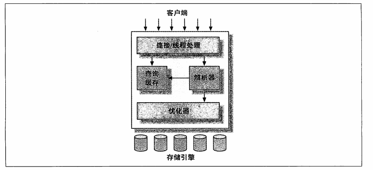
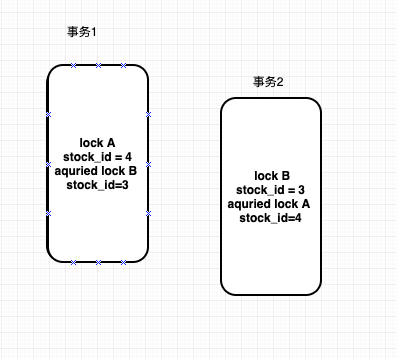

## 。MySQL

> MySQL是一款能运行在PC机器上的，高度灵活配置的关系型数据库。它被设计得将查询处理(Query Processing) 以及其他任务系统(Server Task)和数据的存储/提取相分离。

### 1、MySQL的逻辑架构

MySQL服务器的逻辑架构图：



MySQL服务器分为三层：

1. **连接处理器**，MySQL中为每个客户端连接提供一个单独的线程(MySQL5.5提供了支持线程池的插件，可以使用少量的线程来服务大量的连接)进行处理。这层主要涵盖的是连接处理、授权认证、安全等等。
2. **查询优化解析器**， 主要的核心功能包含在此部分：包括查询解析、分析、优化、缓存以及所有内置函数(例如：日期、时间、数学和加密函数)，还包含所有跨存储引擎的功能都在这一层：如：存储过程、触发器、视图等。
3. **存储引擎，**存储引擎负责MySQL中数据的存储和提取。内置有多种存储引擎的实现，每个引擎都存在自己的优势和劣势。服务器通过API和存储引擎进行通信。这些接口屏蔽不同存储引擎之间的差异，这使得这些差异对上层的查询过程透明。存储引擎API包含几十个底层函数，存储引擎不会去解析SQL(Innodb它会解析外键定义，因为MySQL服务器本身没有实现该功能)。不同的存储引擎也会相互通信。只会响应上层服务器的请求。

---

### 2、 连接&执行

**连接：** 前面所提到的，服务器会为每个客户端连接创建一个线程，这样可以减少每个客户端之间的存在的并发冲突。服务器会将每个创建的线程缓存起来，避免频繁地为每个客户端连接都执行一次创建、销毁线程的动作。

​		客户端连接时，还会进行安全认证，认证时基于用户名和密码以及主机信息。还支持安全套接字(SSL)，还可以使用X.509证书认证。认证成功后，还会继续验证该客户端是否具有执行某个特定查询的权限。

**执行：**MySQL会解析查询，并创建解析树，然后对其进行优化，这里包括：**重写查询**、**表的读取顺序**、**选择索引**。用户还可以使用特殊的关键字提示优化器，影响它的决策过程。也可以请求优化解释器(explain)优化过程的各个因素，可以使用户知道服务器是如何进行优化决策的，并提供一个参考基准，便于用户重构查询和`sehema`、修改相关配置。

​		优化器并不关心表使用什么存储引擎，但是存储引擎对于优化查询是有影响的。优化器会请求存储引提供容量或某个具体操作的开销信息，以及表数据的统计信息等。

​		对于*select*语句，在解析查询之前，服务器会先检查查询缓存(Query Cache)，如果能够在其中找到对应的查询直接返回缓存中的结果集。

---

### 3、 锁

在MySQL中通常使用锁来解决并发冲突，MySQL中锁的分类大致为：共享锁(shared lock)和排他锁(exclusive lock)，也叫做读锁(read lock)和写锁(write lock)。

**读锁：** 读锁是共享锁的一种，多个连接可以同时读取数据而不相互影响。

**写锁：** 写锁是排他锁的一种，一个连接拥有写锁会阻塞其他任意的操作。写锁的排队顺序会优先读锁的顺序。当出现写锁请求时，会将该请求插队到读请求之前。

#### 3.1 、 锁的粒度

​		MySQL为了提高共享资源的并发性，将锁的实现划分的更加细腻度。尽量只锁定需要修改的那部分数据，而不是在所有数据上枷锁。锁定的数据量越小，则系统的并发程度越高。同样带来的问题的：加锁需要增加系统的开销，锁的细粒度也造成了编码的复杂性和维护性，降低程序的可扩展性。

​		MySQL提供了多种选择的锁实现，不同的存储引擎都有各自的锁策略和锁粒度。但是大致分为如下两种：

1. **表锁(table lock)**

   表锁时MySQL中最基本的锁策略，且开销最小。用户在写数据时，会对整张数据表进行加锁，从而阻塞其他在该表上进行操作的连接。尽管存储引擎中可以管理各自的锁，MySQL本身还是会使用各种有效的表锁来实现不同的目的。例如，当服务器会为`alter table`之类当语句使用表锁，而忽略存储引擎的锁机制。

2. **行级锁(row lock)**

   行级锁是相对于表锁的一种更细粒度的锁，顾名思义，只会锁表中每一行数据，这种细粒度的实现方式为并发提供了很好的扩展。MySQL中目前只有InnoDB个XtraDB，以及其他一些存储引擎中实现了行级锁。行级锁的实现在存储引擎层，而不在MySQL服务器层。

3. **多版本并发控制(MVCC)**

   MVCC可以认为是行级锁的一种变种，它在多数情况下避免了加锁操作，因此开销更低。虽然实现机制有所不同，但大都实现了非阻塞的读操作，写操作也只是锁定必要的行。

   MVCC的实现，是通过保存数据在某个时间点的快照来实现的。无论执行多长时间，每个事务看到的数据都是一致的。根据事务开始的时间不同，每个事务对同一张表，同一时刻看到的数据有可能是不一样的。

   MVCC大致分为两种类型：**乐观(optimistic)并发控制**和**悲观(pessimistic)并发控制**

   对于InnoDB来讲，这种MVCC是一种乐观实现。每行记录的后面隐藏两列(create time 和detele time)。这里的两列值是由系统颁发的一个系统版本号(system version number)。每当开启一个新的事务，系统版本号将自动递增。事务开始时刻的系统版本号回座位事务的版本号，用来和查询到的每行记录的版本号进行比较。

   *举个栗子🌰*

   在MySQL默认的隔离级别(REPEATABLE READ)下，MVCC如下：

   - SELECT

     InnodDB会根据以下两个条件检查每行记录：

     a. 	InnoDB只查找版本早于当前事务版本的数据行(行的系统版本号<=事务的系统版本号)，这昂		可。以确保事务的读取的行，要么在事务开始前已经存在，要么是事务自身插入或者修改过 		的。

     b. 	行的删除版本要么未定义，要么大于当前事务版本号。这样可以确保事务读到的行，在事务		 开始之前都是未删除的。

     只有符合上述两个条件的记录，才能作为返回的查询结果。

   - INSERT

      InnoDB为新插入的每一行保存当前系统版本号作为行版本号。

   - DELETE

      InnoDB为删除的每一行保存当前系统版本号作为行删除标识。

   - UPDATE

     InnoDB为插入一行新纪录，保存当前系统版本号作为行版本号，同时保存当前的系统版本号到原来的行作为行删除标识符。

   **优点：** 通过两个版本号，使得大多数读操作免去了加锁的过程，使得读操作简单，性能更高。

   **缺点：** 每行都需要额外的内存开销维护两个版本号，查询时需要多大检查，以及一些额外的维护工作。

   MVCC目前只能在**REPEATABLE READ **和**READ COMMITTED**下能正确工作。

   **READ UNCOMMITTED** 总是读取最新数据行，而不符合当前事务版本的数据行

   **SERIALIZABLE** 会对所有的读取行加锁

4. 


#### 3.2、死锁

 		既然存在锁的争用，那么必不可少的就是出现死锁。死锁是指两个或者多个事务在同一资源上互相占用，并请求锁定对方锁占用的资源，从而导致的恶性循环的现象。当多个事务试图以不同的顺序锁定资源时，就可能产生死锁。多个事务同时锁定同一个资源时，也会产生死锁。

*看下面的一个🌰*：

**事物1:**

```mysql
start transaction;
update stockPrice set close = 25.50 where stock_id =4  and date='2002-05-01';
update stockPrice set close = 24.50 where stock_id =3  and date='2002-05-02';
commit;
```

**事物2:**

```mysql
start transaction;
update stockPrice set close = 21.50 where stock_id =3  and date='2002-05-02';
update stockPrice set close = 20.50 where stock_id =4  and date='2002-05-01';
commit;
```


当两个事务都执行第一条update语句，更新一行数据，但是当执行第二条update语句时，由于当前事务没有提交，无法释放锁，但是需要获取的锁被对方持有，此时将陷入无限循环等待。除非有外部因素介入才可能解除死锁。



为了解决这种问题，数据库系统实现了各种死锁检测和死锁超时机制。越复杂的系统，比如InnoDB存储引擎，越能检测到死锁的循环依赖，并立即返回一个错误。这种方式很有效，否则死锁会导致出现非常慢点查询。还有一种解决方式，就是当查询的时间达到锁等待超时的设定后放弃锁请求，这种方式通常来说不太好。InnoDB目前处理死锁的方法是，将持有最少行级排他锁的事务进行回滚。


锁的行为和顺序是和存储引擎相关的。以同样的顺序执行语句，有些存储引擎会产生死锁，有些则不会。死锁产生的双重原因：有些是由真正的数据冲突，这种情况通常很难避免，但是有些则完全是由存储引擎的实现方式导致的。

死锁发生以后，	只有部分或者完全回滚其中一个事务，才能打破死锁。对于事务性系统，这是无法避免的，所以应用程序在设计时必须考虑如何处理死锁。大多数情况下只需要重新执行因死锁回滚的事务即可。

---

### 4、 事务

提到数据库，当然离不开的是**事务的概念**与事务的**隔离级别**，从而保证数据库中数据的完整可靠性。

##### 1. 事务的概念(ACID)

- 原子性(atmoicity) 	一个事务必须被视为一个不可分割的最小工作单元，整个事务中的操作要么全部提交(**commit**)成功，要么全部失败回滚(**rollback**)。对于一个事务不可能存在一部分执行成功，另一部分失败的操作。
- 一致性(consistency)  数据库总是从一个一致性的状态转换到另外一个一致性的状态，该条特性与第一条密不可分。
- 隔离性(isolation)  通常来讲，一个事务所做的修改在最终提交之前，另一个事务是不可见的。但是事务存在隔离级别可能会与上述所述有所出入。
- 持久性(durability)  一单事务提交，则所做的修改就会永久保存到数据库中（存储到本地磁盘）。即使是系统崩溃，修改的数据也不会丢失。

​      事务的的ACID特性确实可以保证你的一次操作过程中的数据完整性，但是它也像锁的粒度升级一样，会增加系统的开销。因为事务依赖额外的安全性，也需要数据库系统做更多的额外的工作。一个实现了ACID的数据库比没有实现ACID的数据库，通常会需要更强的CPU处理能力，更大的能存和更多的磁盘空间。

​       MySQL的存储引擎架构设计可以使得我们更加灵活的配置我们需要的执行策略。对于某些少事务应用的场景下，我们可以使用不支持事务的存储引擎(**MyISAM**)来减少系统的开销，以及提升性能，当需要事务时，我们可以采取`lock tables`来进行锁表处理。

##### 2. 隔离界别(isolation level)

SQL标准中定义了四种隔离级别，每一种级别都规定了一个事务中所做的修改，在哪些事务内和事物间是可见的，哪些是不可见的。较低的隔离级别往往能够执行更高的并发，还能够降低系统的开销。

- 未提交读(READ UNCOMMITTED)  在READ UNCOMMITTED级别，事务中的修改，即使没有提交，对其他事物来讲也是可见的。事务可以读取未提交的数据，这也被称之为脏读(Dirty Read)。该级别会导致很多问题，一般不建议使用。
- 提交读(READ COMMITTED)  大多数数据库的默认隔离级别(MySQL除外)，一个事务开始时，只能看见已经提交的事务所做的修改(一个事务从开始到提交之前，所有的修改对其他事物都不可见)。这个级别有时候也叫做不可重复读(norepeatable read)，因为两次执行的同样的查询，可能得到不一样的结果。
- 可重复读(REPEATABLE READ)   REPEATABLE READ(MySQL的默认事务隔离级别)解决了脏读的问题，也就是第一种模式，该模式保证了同一个事物中多次读取的同样的记录结果是一致的。但是理论上，可重复读隔离级别还是无法解决另外一个幻读(Phantom Read)问题。所谓欢度，指的是当某个事务在读取某个范围内的记录时，另外一个事务又在该范围内插入了新的记录，当之前的事务再次读取该范围内的记录时，会产生幻行(Phantom Row)。InnoDB和XtraDB存储引擎通过多版本并发控制(MVCC，Multiversion Concurrency Control)解决幻读问题。
- 可串行化(SERIALIZABLE)  这个是最高的隔离级别。它通过强制事务串行执行，避免了前面的幻读问题。SERIALIZABLE会在读取的每一行数据上都加上锁，所以可能导致大量的超时和锁竞争的问题。实际应用中也很少用到这个隔离级别，只有在非常需要确保数据的一致性而且可以接受没有并发的情况下，才考虑采用该级别。


| 隔离级别         | 脏读可能性 | 不可重复读可能性 | 幻读可能性 | 加锁读 |
| ---------------- | ---------- | ---------------- | ---------- | ------ |
| READ UNCOMMITTED | ✔️          | ✔️                | ✔️          | ✘      |
| READ COMMITTED   | ✘          | ✔️                | ✔️          | ✘      |
| REPEATABLE READ  | ✘          | ✘                | ✔️          | ✘      |
| SERIALIZABLE     | ✘          | ✘                | ✘          | ✔️      |

#### 事务日志

事务日志是用来提高事务效率的。使用事务日志，存储引擎在修改表的数据时只需要修改其内存拷贝，再把该修改行为记录到持久在硬盘上的事务日志中，而不需要每次都将修改的数据本身持久到磁盘。事务日志采用的是追加方式，因此写日志的操作是磁盘上一小块区域内的顺序`I/O`，而不像随机`I/O`需要在磁盘的多个地方移动磁头，所以采用事务日志的方式相对来说要快得多。事务日志持久以后，内存中被修改的数据在后台可以慢慢地刷回到磁盘。目前大多数存储引擎都是这样实现的，我们通常称之为预写式日志(**Write-Ahead Logging**)，修改数据需要写两次磁盘。

对于一次事务操作，如果事务日志持久化，但是数据本身还没写回磁盘，此时系统崩溃，存储引擎在重启时能够自动回复这部分修改的数据。具体的恢复方式则视存储引擎而定。

#### MySQL 事务

MySQL提供两种事务型的存储引擎：InnoDB和NDB Cluster。另外还有一些第三方存储引擎耶支持事务，比较知名的包括XtraDB和PBXT。

##### 自动提交(AUTOCOMMIT)

MySQL默认采用自动提交	，如果不显示地开始下一个事务，则每个查询都被当作一个事务执行提交操作。启用自动提交时，当一个事务提交结束时同时开启另一个新事物。自动提交不适用于非事务型的表(MyISAM)。相当于一直是自动提交。

另外还有一些命令在执行之前会强制执行COMMIT提交当前的活动事务。特别的是，当使用DDL时，如果会导致大量数据改变的操作(ALTER TABLE，或者是LOCK TABLES等)会导致同样的结果。

##### 设置隔离级别

MySQL可以通过执行SET TRANSACTION ISOLATION LEVEL命令来设置隔离级别。新的隔离级别会在下一个事务开始的时候生效。可以通过配置文件设置**整个**数据库的隔离级别。

##### 不允许在事务中混合使用存储引擎

MySQL服务器不管事务，事务是由下层的存储引擎管理的，所以在同一个事物中，使用多个存储引擎是不可靠的。如果在正常情况下混合提交没有什么问题，但是一旦发生回滚，哪些作用在非事务型的表上的数据的更改就无法撤销，这将导致数据不一致。

##### 隐式和显示锁定

InnoDB采用的是两阶段锁协议(two-phase locking protocl)。

**隐式锁：**在事务执行的过程中，随时可以执行锁定，锁只有在执行**commit**或者**rollback**时才会释放，并且所有的锁在同一时刻被释放。InnoDB会根据隔离级别在需要的时候自动加锁。

**显示锁：** 可以使用如下语句来显示执行锁定：

- SELECT … LOCK IN SHARE MODE
- SELECT … FOR UPDATE

另外，MySQL在服务层支持几种锁定实现：LOCK TABLES和UNLOCK TABLES。这些并不是事务的代理品。当需要事务时，应该还是选择事务型存储引擎。


