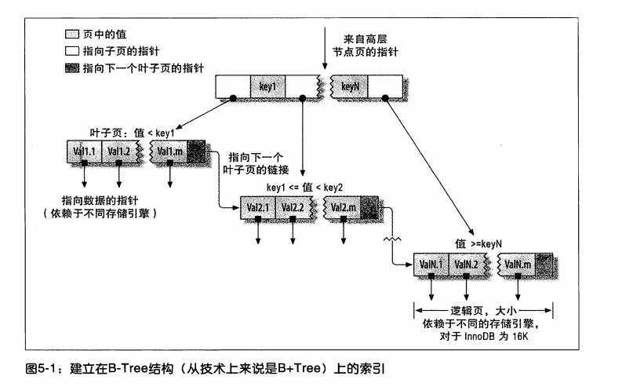
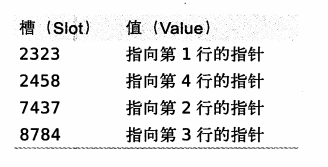
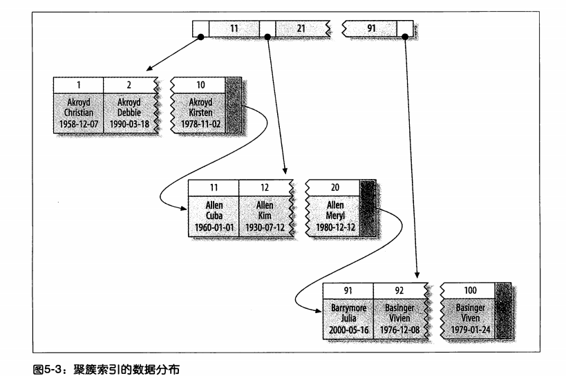

## 创建高效的索引

> 索引(在MySQL中也叫做“键(key)”)是存储引擎用于快速找到记录的一种数据结构。


### 索引基础

MySQL中存储引擎需要查找一行记录时，其现在索引中找到对应值，然后根据匹配的索引记录找到对应的数据行。

索引可以包含一个或者多个列的值。如果索引包含多个列，那么列的顺序也十分重要，因为MySQL只能高效地使用索引的最左前缀列。创建一个包含两个列的索引和创建两个只包含一列的索引的大小是不相同的。


#### 索引类型

索引有很多类型，每种都有不同的应用场景。在MySQL中，索引是在存储引擎层而不是服务层实现。

##### B-Tree索引

这是一款使用B-Tree数据结构来存储数据的索引。

B-Tree通常意味着所有的值都是按照顺序存储的，并且每一个叶子页到根的距离相同。



**B+Tree:** 每个叶子结点都包含指向下一个叶子结点的指针，从而方便叶子结点的范围遍历。

B-Tree索引能够加快访问数据的速度，因为存储引擎不再需要进行全表扫描来获取需要的数据，取而代之的是从索引的根节点开始搜素。根节点的槽中存放了指向字节点的指针，存储引擎根据这些指针向下层查找。通过比较节点页的值和要查找的值可以找到合适的指针进入下层字节点，这些指针实际上定义了子节点页中值的上限和下限。

叶子节点比比较特别。它们的指针指向的是被索引的数据，而不是其他的节点页

B-Tree对索引列是顺序组织存储的，所以合适进行范围检索。

**可以使用B-Tree索引的查询类型**。B-Tree适用于全键值、键值范围或者键前缀查找。其中键前缀查重只适用于根据**最左前缀**的查找。

- *全值匹配*

  全值匹配指的是和索引中的所有列进行匹配

- *匹配最左前缀*

  如果一个索引中，包含多个列，则优先使用最左边的(第一列)

- *匹配列前缀*

  也可以只匹配某一列的值的开头部分

- *匹配范围值*

  可以匹配区间段，例如[1,8]，匹配这个区间段的

- *精确匹配某一列并范围匹配另外一列*

  当索引是多个列时，可以全匹配第一列，第二列进行范围匹配

- *只访问索引的查询*

  B-Tree通常可以支持“只访问索引的查询”，即查询只需要查询索引，而无需访问数据行。

因为索引树中的节点是有序的，所以除了按值查找之外，索引还可以用于查询中的Order by操作。

**B-Tree索引的限制：**

- 如果不是按照索引的最左列开始查找，则无法使用索引

- 不能跳过索引中的列

- 如果查询中有某个列的范围查询，则其右边的所有列都无法使用索引优化查找。例如有查询

  ```mysql
  select * from user where last_name = 'Smith' and first_name  like 'J%' and 
  dob = '1976-12-23'
  ```

  此时这个索引只能使用前两列。如果范围查询列的值数量有限，则可以使用多个等于来代替。

##### 哈希索引

哈希索引是基于哈希表实现，只有**精确匹配**索引所有列的查询才有效。对于每一行数据，存储引擎都会对所有的索引列计算一个哈希码，哈希码是一个较小的值，并且不同键值的行计算出来的哈希码也不一样。哈希索引将所有的哈希码存储在索引中，同时在哈希表中保存指向每个数据行的指针。如果多个列的哈希值相同，索引会以链表的方式存放多个记录指针到同一个哈希表条目中。

哈希索引的结构如下：



注意每个槽点编号是顺序的，但是数据行不是。

因为索引自身只需要存储对应的哈希值，所以索引的结构十分紧凑，这也让哈希索引查找的速度非常快。当然它也是存在一定的限制：

- 哈希索引只包含哈希值和行指针，而不存储字段值，所以不能使用索引中的值避免读取行。不过，访问内存中的行的速度很快，所以大部分情况下这一点对性能的影响并不明显
- 哈希索引数据不是按照索引值顺序存储的，所以无法用于排序
- 哈希索引也不支持部分索引列匹配查找，因为哈希索引始终是使用索引列的全部内容来计算哈希值。例如，在数据列(A,B)上建立哈希索引，如果查询只有数据列A，则无法适应该索引
- 哈希索引只支持等值比较查询，包括=、IN()、<=>。也不支持任何范围查询，例如where price > 100
- 访问哈希索引数据非常快，除非有很多哈希冲突。当出现哈希冲突时，存储引擎必须遍历链表中的所有行指针，逐行进行比较，直到找到所有符合条件的行
- 如果哈希冲突很多的话，一些索引维护操作的代价变高。例如：如果在某个选择性很低的列上建立哈希索引，那么当从表中删除一行时，存储引擎需要遍历对应哈希值当链表中的每一行，找到并删除对应行的引用，冲突越多，代价越大

哈希索引就非常适合查找表的需求，但是不适合数据列选项特别少的值(如：性别，类型，这种枚举性质的列)。

**自适应哈希索引**

在InnoDB引擎中有一个特殊的功能叫做“自适应哈希索引”。当InnoDB注意到某些索引值被使用得非常频繁时，它会在内存中基于B-Tree索引之上再创建一个哈希索引，这样就能让B-Tree索引也具有和哈希索引一样的优点(快速的哈希查找)。

**自定义哈希索引**

如果存储引擎不支持哈希索引，则可以模拟像InnoDB一样创建哈希索引。

*思路：* 在B-Tree基础上创建一个伪哈希索引。这和真正的哈希索引不是一回事，因为还是使用B-Tree进行查找，但是它使用哈希值而不是键本身进行索引查找。你需要做的就是在查询的Where子句中手动指定使用哈希函数。

这种伪哈希的方式，是移除表中的其他索引，然后新增加一列`hashcode`，在`hashcode`上添加索引，在insert操作时，可以自定义一个触发器，每次操作时，自动添加一个经过hash函数计算过的值。

每次查询的时候可以使用经过hash处理过后的值，进行查询。

```mysql
select * from url = where url_crc = CRC32("http://www.mysql.com")
```

**注意：**我们使用的Hash函数最好是返回一串数字，而不是字符串。这样不仅可以节约内存，还可以加快检索速度。但是，当列的数据量增加时，会爆发激烈哈希冲突，这时我们可以选择重新使用其他长度更长的哈希函数，或者是使用向下面这样:

```mysql
select * from url = where url_crc = CRC32("http://www.mysql.com") and url = "http://www.mysql.com"
```

##### 空间索引(R-Tree)

MyISAM表支持空间索引，可以用作地理数据存储。和B-Tree索引不同，这类索引无须前缀查询。空间索引会从所有维度来索引数据。查询时，可以有效地使用任意维度来组合查询。必须使用MySQL的GIS相关函数如MBRCONTAINS()等来维护数据。MySQL的GIS支持并不完善，所以大部分人都不回使用这个特性。开源关系数据库系统中对GIS的解决方案做的比较好的是PostgreSQL的PostGIS。

##### 全文索引

全文索引是一种特殊类型的索引，它查找的是文本中的关键词，而不是直接比较索引中的值。全文搜素和其他几类索引的匹配方式完全不一样。它有许多需要注意的细节，如停用词、词干和复数、布尔搜索等。全文索引更类似于搜索引擎做的事情，而不是简单的Where条件匹配。

在相同的列上同时创建全文索引和基于值的B-Tree索引不会有冲突，全文索引适用于MATCH AGAINST操作，而不是普通的WHERE条件操作。

---

### 索引优点

索引可以让服务器快速定位到表的指定位置。但是这并不是索引的唯一作用，不同的索引数据结构，它的功能也不大相同，在B-Tree索引中，由于是按照顺序存储的方式来存储索引，所以B-Tree也就会将相关的列值都存储在一起。最后因为索引中存储了实际的列值，所以某些查询只需要查询索引就能完成全部的查询。以下为概括的三点：

1. 索引大大减少了服务器需要扫描的数据量
2. 索引可以帮助服务器避免排序和临时表
3. 索引可以将随机I/O变为顺序I/O

当然索引也不是万能的，对于索引的建立我们需要慎重。索引的不恰当使用，不仅不能提高查询效率，而且还有很多的弊端，比如，如果在每一列上建立索引后，如果数据表增长，那么会造成内存的急剧下降。

---

#### 高性能的索引策略

1. **独立的列**  

   索引列上不要使用表达式，或者是使用函数

2. **前缀索引和索引选择性**

   有时候需要搜索的字符串很长，这样会使索引变大且慢。我们可以选择索引列的前几个字符，这样可以节约索引空间，提升索引效率，但是随之而来的就是索引的选择性降低，也就是能够检索到正确数据的概率降低。索引选择性越高，查询性能最好。

   计算合适的前缀长度和另外一个办法就是计算完整列的选择性，并使用前缀的选择性接近于完整列的选择性。

   计算完整列的选择性:

   ```mysql
   select count(distinct columnName) / count(*) from tableName ;
   ```

   计算不同前缀长度的选择性:

   ```mysql
   select count(distinct left(columnName,3)) / count(*) as sel3,
    			 count(distinct left(columnName,4)) / count(*) as sel4,
          count(distinct left(columnName,5)) / count(*) as sel5,
   	 		 count(distinct left(columnName,6)) / count(*) as sel6,
   			 count(distinct left(columnName,7)) / count(*) as sel7
   			 from tableName;
   ```

   如果建立前缀索引：

   ```mysql
   alter table tableName add key (columnName(length))
   ```

   **注意：** 使用前缀索引无法在`order by`和`group by`	以及覆盖扫描中生效。

3. **多列索引**

   对多列索引的理解错误就是，在多个列上建立独立的索引。但是有时候这不仅仅不能增加查询效率，反而还会导致性能下降。

   MySQL会根据你所使用的索引情况进行优化，**索引合并策略**就是一种手段：

   - 当出现多个索引做相交操作时，这就意味着需要建立一个包含多个列的一个索引，而不是在多个列上分别建立索引
   - 当对多个索引做联合操作时，通常需要耗费大量CPU和内存资源在算法的缓存、排序和合并操作上。特别是当某些索引的想则行不高，需要合并扫描返回的大量数据的时候。
   - 优化器不会把这些计算到“查询成本”中，优化器只关心随机页面读取。这会使得查询到成本被“低估”，导致该执行计划还不如直接走全表扫描。

   可以同时参数`optimizer_switch`来关闭索引合并功能，也可以使用`IGNORE INDEX`提示让优化器忽略掉某些索引。

4. **选择合适的索引顺序列顺序**

   索引顺序，主要是针对B-Tree索引，这类排序索引而言。索引可以按照升序或者降序进行扫描，以满足精神符合列顺序的`order by`，`group by` 和`distinct`等子句的查询需求。

   *有一条经验法则是：将选择性最高的列放在索引最前列*。这可能在某些场景下游泳，但通常不如避免随机I/O和排序那么重要。不同的场景下，有不同的准则。

5. **聚簇索引**

   聚簇索引并不是一种单独的索引类型，而是一种数据存储的方式。具体的细节依赖于其实现方式，但InnoDB的聚簇索引实际上在同一个结构中保存了B-Tree索引和数据行。

   当表有聚簇索引时，它的数据行水上存放在索引的叶子页中。术语“聚簇”表示数据行和相邻的键值紧凑地存储在一起。因为无法同时把数据行存放在两个不同的地方，所以一个表只能有一个聚簇索引。

   具体的如下图所示：

   

   叶子页包含了行的全部数据，但是节点页只包含了索引列。

   聚簇索引的优点；

   - 可以把相关数据保存在一起。例如实现电子邮箱时，可以根据用户ID来聚集数据，这样只需要从磁盘读取少数的数据页就能获取某个用户的全部邮件。如果没有使用聚簇索引，则每封邮件都可能导致一次磁盘I/O
   - 数据访问更快。 聚簇索引将索引和数据保存在同一个B-Tree中，因此从聚簇索引中获取数据通常比在非聚簇索引中查找要快
   - 使用覆盖索引扫描的查询可以直接使用页节点中的主键值

   聚簇索引的缺点：

   - 聚簇数据最大限度地提高了I/O密集型应用的性能，但如果数据全部都放在内存中，则访问的顺序就没那么重要了，聚簇索引也就没什么优势
   - 插入速度严重依赖于插入顺序。 按照主键的顺序插入是加载数据到InnoDB表中速度最快的方式。但如果不是按照主键顺序加载数据，那么在加载完成后最好使用`optimize table`命令重新组织一下表
   - 更新聚簇索引列的代价很高，因为会强制InnoDB将每个被更新的行移动到新的位置基于聚簇索引的表在插入新行，或者主键被更新导致需要移动行的时候，可能面临“页分裂”的问题。当行的主键值要求必须将这一行插入到某个已满的页中时，存储引擎会将该页分裂成两个页面来容纳该行，这就是一次页分裂操作。页分裂会导致表占用更多的磁盘空间
   - 聚簇索引可能导致全表扫描变慢，尤其是行比较稀疏，或者由于分裂页导致数据存储不连续的时候
   - 二级索引(非聚簇索引) 可能比想象的还要更大，因为在二级索引的叶子节点包含了引用行的主键列
   - 二级索引访问需要两次索引查找，而不是一次

   二级索引中的叶子节点保存的不是指向物理位置的地址指针，而是行的主键，这意味着二级索引查找行时，存储引擎需要去二级索引的叶子节点找到对应的主键值，然后通过这个值去聚簇索引中查找对应的行。这里做了两次重复的工作：两次B-Tree查找而不是一次，对于InnoDB，自适应哈希索引能够减少这样的重复。

   

6. **覆盖索引**

   如果一个索引包含所有需要查询的字段的值，我们就称之为“覆盖索引”。

   覆盖索引是非常有用的工具，能够极大地提高性能。有时候还能避免回表查询。

   - 索引条目通常远小于数据行大小，所以如果只需要读取索引，那么MySQL就会极大地减少数据访问量。这对缓存的负载非常重要，因为这种情况下响应时间大部分花费在数据拷贝上。覆盖索引对于I/O密集型的引用也有帮助，因为索引比数据更小，更容易全部放入内存中(MyISAM会对索引进行压缩)。
   - 因为索引是按照列值顺顺序存储的，所以对于I/O密集型的范围查询会比随机从磁盘读取每一行都I/O要少得多。对于某些存储引擎，例如MyISAM喝XtraDB，甚至可以通过OPTIMIZE命令使得索引完全顺序排列，这让简单的范围查询能使用完全顺序的索引访问。
   - 一些存储引擎如MyISAM在内存中只缓存索引，数据则依赖于操作系统来缓存，因此要访问数据需要一次系统调用。这可能会导致严重的性能问题，尤其是那些系统调用占了数据访问中的最大开销的场景。
   - 由于InnoDB的聚簇索引，覆盖索引对InnoDB表特别有用。InnoDB的二级索引在叶子节点中保存了行的主键值，所以如果二级主键能够覆盖查询，则可以避免对主键索引对二次查询。

   覆盖索引必须要存储索引列的值，而哈希索引、空间索引和全文索引等都不存储索引列的值，所以MySQL只能使用B-Tree索引做覆盖索引。

7. **使用索引扫描来排序**

   MySQL有两种方式可以生成有序的结果：排序操作和安索引顺序扫描。如果explain出来的type列的值为"index"，则说明MySQL使用了索引扫描来做排序。

   MySQL中只有当索引的列顺序和order by子句的顺序完全一致，并且所有的列排序方向都是一样的，才可以使用索引来对结果排序。如果查询需要关联多张表，则只有当order by子句引用的字段全部为第一个表时，才能使用索引做排序。order by子句和查找型查询的限制一样的：需要满足索引的最左前缀的要求，否则，MySQL都需要执行排序操作，而无法利用索引排序。

   当Order by子句在前导列为常量时，如果where子句或者join子句对这些列指定了常量，就可以“弥补”索引的不足。这时explain中将不会出现`filesort`

   

8. 

9. 


