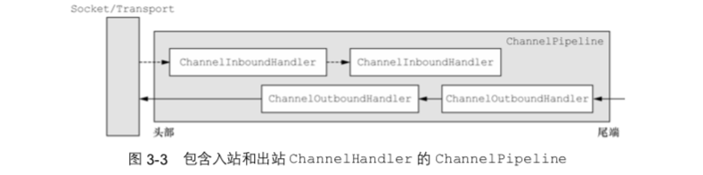

## Netty 笔记

#### Q1. SimpleChannelInboundHandler & ChannelInboudHandler的区别

当调用channelRead0()方法完成时，SimpleChannelInboundHandler负责释放指向保存该消息的ByteBuf内存引用。

ChannelInboundHandlerAdpater是ChannelInboudHandler的一个适配器，为了方便使用者享受ChannelInboudHandler的功能时，不必要实现所有的接口逻辑。ChannelInboudHandler在调用channelRead()方法后可能没有完成，所以不会释放消息，而是要等到在channelReadComplete()调用writeAndFlush()方法时，消息才被被释放掉。

#### Q2. ChannelInboundHandler 与ChannelOutboundHandler的数据流向

netty内部维护一个pipeline管道，里面存放着相关的handler，对于In操作类型的数据，是从soket开始层层处理到应用服务器。而out操作的类型数据，是从应用程序层层处理到底socket，然后写会给客户端。

pipeline中可以混合存在ChannelInboundHandler和ChannelOutboundHandler，它能自动识别哪些数据是使用in操作还是out操作。并且同一事件只会在一个方向传递。

针对数据的写入，我们可以使用**ChannelHandlerContext**来处理，这是一个处理上下文，内部包含channel的引用。当我们使用channel.write时，会导致导致消息从处理器管道（pipline）的尾部开始流动，而ChannelHandlerContext.write方法只会从管道中当前位置处理器的下一个处理器流动。

