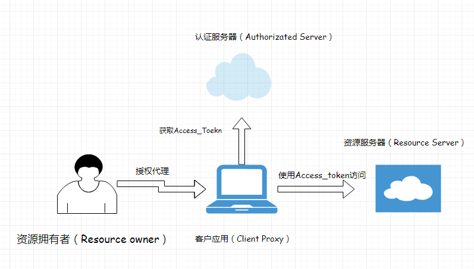

# Spring Security OAuth2.0实践


## OAuth2.0 简介

OAuth2.0 是一套授权体系的开放**标准**，注意：OAuth2.0 并不是一个框架，而是一套制定的授权标准，内部定义了四大组件：

- 客户应用（Client　Application）：典型代表为：Web端，或者移动端
- 资源服务器（Resource Server）: 通常为web端，或者web service api，用户的受保护资源存放于此。
- 授权服务器（Authorized Server）: 客户端用于认证与获取授权Token的服务器
- 资源拥有者（Resource Owner）：资源拥有者

### 认证架构图



### OAuth2.0 授权体系流程的四种模式

> OAuth2.0 为我们制定了四种授权模式，分别是授权码模式（Authorizated_code），简化版授权模式(Implicit)，密码模式（Resource Owner Password Credentials），客户端凭证（Client Credentials）

#### 授权码模式

下面是FLOW流程图，截取自[ 官网](<https://tools.ietf.org/html/rfc6749>)：


该模式是最为复杂的授权模式：

1.  首先用户使用的代理客户端需要再Authorization Server上进行授权认证，一般来说都会有一个Client_Id与secret存放于Authorization Server上。
2. 资源拥有者（这里的泛指享有资源使用权限者）通过代理客户端去Authorization Server获取授权码Authorizated_Code
3. 拿到授权码后，通过这个授权码来获取相应的Access_token
4. 通过Token去Resource Server上访问相应的资源信息
5. 一般获取授权码的时候都需要加上State状态标志，防止CSRF*跨站*请求伪造

---

## Spring Security OAuth2.0

> ​	Spring Security 是Spring全家桶中一套强大的安全框架体系（授权、认证、权限、审计），在内部也实现了OAuth2.0的功能

接下来，我们使用Spring Security OAuth2.0来搭建授权码模式的授权流程。在Spring Security OAuth2.0中，其实是可以将Authorization Server 与 Resource Server放在一起的，但是在生产实践中，不建议这样做，我们需要将Authorization Server独立部署，在微服务体系中。Authorization Server承担的访问压力肯定是大于 Resource Server的，所以我们需要单独剥离出来。

**我们选择的版本为spring-security-oauth2 2.3.5.RELEASE**

**注意：** 在spring-security的各个版本上可能会存在些许差异，主要选择的版本，本次实践构建在spring-security5.x的基础上。


### 搭建Authorization Server

1. 需要扩展一个父类AuthorizationServerConfigurerAdapter

   ```java
   @Configuration
   @EnableAuthorizationServer
   public class AuthConfig extends AuthorizationServerConfigurerAdapter {
   
   
       @Override
       public void configure(AuthorizationServerSecurityConfigurer security) throws Exception {
           security.checkTokenAccess("isAuthenticated() || isAnonymous() ||hasAuthority('ROLE_TRUSTED_CLIENT')")
                   .tokenKeyAccess("isAnonymous() ||hasAuthority('ROLE_TRUSTED_CLIENT')").passwordEncoder(
                   new MyPasswordEncoder()
           );
       }
   
   
       @Override
       public void configure(AuthorizationServerEndpointsConfigurer endpoints) throws Exception {
           endpoints.allowedTokenEndpointRequestMethods(HttpMethod.GET, HttpMethod.POST);
       }
   
   
       @Override
       public void configure(ClientDetailsServiceConfigurer clients) throws Exception {
           clients.inMemory()
                   // client name. such as : appId
                   .withClient("client")
                   // client secret
                   .secret("inner")
                   //  redirect url,callback url.
                   .redirectUris("http://localhost:1004/callback")
                   // authorization type :
                   //  total have four.
                   // authorization_code, password ,
                   .authorizedGrantTypes("authorization_code")
                   // authorization scope
                   .scopes("read", "write")
                   .and()
                   .withClient("haloo")
                   .scopes("123456");
       }
   }
   ```

2.  实现一个自己的密码加密器

   ```java
   public class MyPasswordEncoder implements PasswordEncoder {
   
       @Override
       public String encode(CharSequence charSequence) {
           return charSequence.toString();
       }
   
       @Override
       public boolean matches(CharSequence charSequence, String s) {
           return s.equals(charSequence.toString());
       }
   
   }
   ```

   注意哦：这点是必须的，你必须选择一个密码加密器，不然的话内部不会提供加密器，这将导致你无法获取到Access_token

3.  本次实例，我们选择使用的是基于内存的用户认证模式，所以需要再配置文件中添加用户信息

   ```yaml
   spring:
     application:
       name: "auth-server"
     security:
       user:
         name: haloo
         password: 123456
   ```

---

### 搭建Resource Server

1. 同样的，我们也需要扩展一个父类ResourceServerConfigurerAdapter

   ```java
   @Configuration
   @EnableResourceServer
   public class ResourceConfig extends ResourceServerConfigurerAdapter {
   
   
       public ResourceServerTokenServices resourceServerTokenServices() {
           RemoteTokenServices resourceServerTokenServices = new RemoteTokenServices();
           resourceServerTokenServices.setCheckTokenEndpointUrl("http://localhost:1002/oauth/check_token");
           resourceServerTokenServices.setClientId("haloo");
           resourceServerTokenServices.setClientSecret("123456");
           return resourceServerTokenServices;
       }
   
       @Override
       public void configure(ResourceServerSecurityConfigurer resources) throws Exception {
           resources.resourceId("haloo").tokenServices(resourceServerTokenServices());
       }
   
       @Override
       public void configure(HttpSecurity http) throws Exception {
           http.authorizeRequests()
                   .anyRequest()
                   .authenticated()
                   .and()
                   .requestMatchers()
                   .antMatchers("/api/**");
       }
   }
   ```

   在这上面，重点在于ResourceServerTokenServices的实现，因为资源服务器独立部署，所以我们需要让资源服务器去访问授权服务器，访问token是否合法，认证服务器内部提供的检测地址为：`oauth/check_token`。

   注意：我们还需要给资源服务器提供用户名和密码，这样授权服务器才会接受来自资源服务器的请求。

   这样我们分别启动授权服务器和资源服务器就可以按照上述流程来访问了。

### 访问流程

1. 在浏览器输入如下地址：


<http://localhost:1002/oauth/authorize?client_id=client&redirect_uri=http://localhost:1001/callback&response_type=code&scope=read>

简单介绍一下每次参数的含义：

http://localhost:1002/oauth/authorize? 这个是授权服务器的授权地址，也就是获取授权码

- client_id： 这个代表的是，你的客户端id，需要再授权服务器上注册的

- redirect_uri： 获取授权码后的重定向地址，这个地址在授权服务器也要保持一致

- response_type: 表示的授权类型，现在选的code代表授权码模式

- scpoe: 用户访问权限范围

2.  回车后出现如下地址：

   

   这个后面拿到的code就是授权码，前面提到过，为什么要使用state变量，因为这个code是使用重定向技术来传递的，所以有些插件或者，一些其他的软件可以拦截这个重定向地址，获取授权码，然后通过这个授权码去授权码上获取token，如此一来，那不是可以肆无忌惮访问你的资源呢。

3. 接下来，我们需要取获取token

   使用POST请求，输入如下地址，这个code需要填上面你地址中出现的code，否则你是无法获取token的

   http://localhost:1002/oauth/token?code=WAtBv8&grant_type=authorization_code&redirect_uri=http://localhost:1001/callback&scope=read

    还有个重点：就是你需要再请求头部，再次插入client_id，和密码，用于授权服务器的认证。

   下面我们使用postmen来模拟：

   


​	这样我们就获取到token了。

4.  访问资源服务器

   

---

### 扩展，使用客户端程序来实现功能

​		上述操作是一个比较繁琐的过程，所以我们可以使用程序来简化这个过程，获取token的过程应该交给客户端程序来完成，我们只关心确认授权的过程。具体实现就不再这里展开叙述了。可以参考这里的[代码](<https://github.com/easyhaloo/spring-security-learning>).

