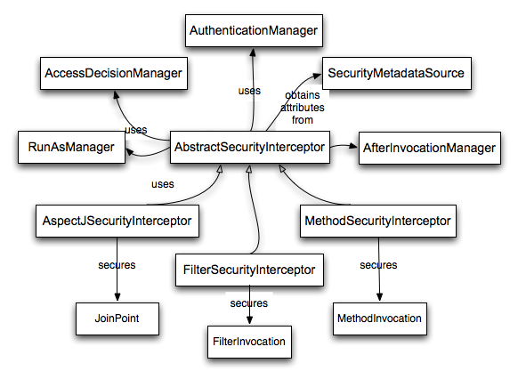

## 8. Architecture and Implementation

熟悉设置和运行某些基于命名空间配置的应用程序后，您可能希望更多地了解框架在命名空间外观背后的实际工作方式。与大多数软件一样，Spring Security具有某些中心接口，类和概念抽象，这些都是整个框架中常用的。在参考指南的这一部分中，我们将介绍其中的一些内容，并了解它们如何协同工作以支持Spring Security中的身份验证和访问控制。

### 8.1 Technical Overview

#### 8.1.1 Runtime Environment

Spring Security 3.0需要Java 5.0 Runtime Environment或更高版本。由于Spring Security旨在以独立方式运行，因此无需将任何特殊配置文件放入Java运行时环境中。特别是，无需配置特殊的Java身份验证和授权服务（JAAS）策略文件，也无需将Spring Security放入常见的类路径位置。

同样，如果您使用的是EJB容器或Servlet容器，则无需在任何地方放置任何特殊配置文件，也不需要在服务器类加载器中包含Spring Security。所有必需的文件都将包含在您的应用程序中。

这种设计提供了最大的部署时间灵活性，因为您可以简单地将目标工件（无论是JAR，WAR还是EAR）从一个系统复制到另一个系统，它将立即起作用。

#### Core Components

在Spring Security 3.0中，spring-security-core jar的内容被剥离到最低限度。它不再包含与Web应用程序安全性，LDAP或命名空间配置相关的任何代码。我们将在这里看一下您将在核心模块中找到的一些Java类型。它们代表了框架的构建块，因此如果您需要超越简单的命名空间配置，那么即使您实际上不需要直接与它们进行交互，您也必须了解它们是什么。

#### SecurityContextHolder, SecurityContext and Authentication Objects

最基本的对象是SecurityContextHolder。这是我们存储应用程序当前安全上下文的详细信息的地方，其中包括当前使用该应用程序的主体的详细信息。默认情况下，SecurityContextHolder使用ThreadLocal来存储这些详细信息，这意味着安全上下文始终可用于同一执行线程中的方法，即使安全上下文未作为这些方法的参数显式传递。如果在处理当前主体的请求之后注意清除线程，以这种方式使用ThreadLocal是非常安全的。当然，Spring Security会自动为您解决这个问题，因此无需担心。


某些应用程序并不完全适合使用ThreadLocal，因为它们使用线程的特定方式。例如，Swing客户端可能希望Java虚拟机中的所有线程都使用相同的安全上下文。SecurityContextHolder可以在启动时配置策略，以指定您希望如何存储上下文。对于独立应用程序，您将使用SecurityContextHolder.MODE_GLOBAL策略。其他应用程序可能希望安全线程生成的线程也采用相同的安全标识。这是通过使用SecurityContextHolder.MODE_INHERITABLETHREADLOCAL实现的。您可以通过两种方式从默认的SecurityContextHolder.MODE_THREADLOCAL更改模式。第一个是设置系统属性，第二个是在SecurityContextHolder上调用静态方法。大多数应用程序不需要更改默认值，但如果这样做，请查看JavaDoc for SecurityContextHolder以了解更多信息。


##### Obtaining information about the current user

在SecurityContextHolder中，我们存储当前与应用程序交互的主体的详细信息。Spring Security使用Authentication对象来表示此信息。您通常不需要自己创建Authentication对象，但用户查询Authentication对象是相当常见的。您可以使用以下代码块（从应用程序的任何位置）获取当前已验证用户的名称，例如：

```java
Object principal = SecurityContextHolder.getContext().getAuthentication().getPrincipal();

if (principal instanceof UserDetails) {
String username = ((UserDetails)principal).getUsername();
} else {
String username = principal.toString();
}
```

调用getContext（）返回的对象是SecurityContext接口的一个实例。这是保存在线程本地存储中的对象。正如我们将在下面看到的，Spring Security中的大多数身份验证机制都会返回UserDetails的实例作为主体。

#### The UserDetailsService

上面代码片段中需要注意的另一个项目是您可以从Authentication对象中获取主体。校长只是一个对象。大多数情况下，这可以转换为UserDetails对象。UserDetails是Spring Security中的核心接口。它代表一个主体，但是以可扩展和特定于应用程序的方式。将UserDetails视为您自己的用户数据库与SecurityContextHolder中Spring Security所需的适配器之间的适配器。作为来自您自己的用户数据库的东西的表示，通常您会将UserDetails转换为您的应用程序提供的原始对象，因此您可以调用特定于业务的方法（如getEmail（），getEmployeeNumber（）等）。


到现在为止你可能想知道，所以我什么时候提供UserDetails对象？我怎么做？我以为你说这个东西是声明性的，我不需要编写任何Java代码 - 是什么给出的？简短的回答是有一个名为UserDetailsService的特殊接口。此接口上唯一的方法接受基于String的用户名参数并返回UserDetails:

```java
UserDetails loadUserByUsername(String username) throws UsernameNotFoundException;
```

这是在Spring Security中为用户加载信息的最常用方法，只要需要有关用户的信息，您就会看到它在整个框架中使用。

在成功进行身份验证后，UserDetails用于构建存储在SecurityContextHolder中的Authentication对象（详见下文）。好消息是我们提供了许多UserDetailsService实现，包括一个使用内存映射（InMemoryDaoImpl）和另一个使用JDBC（JdbcDaoImpl）的实现。但是，大多数用户倾向于自己编写，他们的实现通常只是位于代表其员工，客户或应用程序其他用户的现有数据访问对象（DAO）之上。记住，无论你的UserDetailsService返回什么，总是可以使用上面的代码片段从SecurityContextHolder获得。

> 关于UserDetailsService经常会有一些混乱。它纯粹是用户数据的DAO，除了将数据提供给框架内的其他组件之外，不执行任何其他功能。特别是，它不会对用户进行身份验证，这是由AuthenticationManager完成的。在许多情况下，如果您需要自定义身份验证过程，则直接实现AuthenticationProvider会更有意义。

####  GrantedAuthority

的另一个重要方法是getAuthorities（）。此方法提供GrantedAuthority对象的数组。毫无疑问，GrantedAuthority是授予委托人的权威。此类权限通常是“角色”，例如ROLE_ADMINISTRATOR或ROLE_HR_SUPERVISOR。稍后将为Web授权，方法授权和域对象授权配置这些角色。Spring Security的其他部分能够解释这些权限，并期望它们存在。GrantedAuthority对象通常由UserDetailsService加载。

通常，GrantedAuthority对象是应用程序范围的权限。它们不是特定于给定的域对象。因此，您可能不会有GrantedAuthority来表示对Employee对象编号54的权限，因为如果有数千个这样的权限，您将很快耗尽内存（或者，至少导致应用程序需要很长时间验证用户的时间）。当然，Spring Security专门设计用于处理这个常见要求，但您可以使用项目的域对象安全功能来实现此目的。

#### Summary

回顾一下，我们目前看到的Spring Security的主要构建块是：

- `SecurityContextHolder`, 提供访问 `SecurityContext`.
- `SecurityContext`, 用于保存身份验证和可能的特定于请求的安全信息。
- `Authentication`, 以Spring Security特定的方式表示主体。
- `GrantedAuthority`,反映授予主体的应用程序范围的权限。
- `UserDetails`,提供从应用程序的DAO或其他安全数据源构建Authentication对象所需的信息。
- `UserDetailsService`, 在基于字符串的用户名（或证书ID等）中传递时创建UserDetails。

既然您已经了解了这些重复使用的组件，那么让我们仔细看看身份验证的过程。


#### 8.1.3 Authentication

Spring Security可以参与许多不同的身份验证环境。虽然我们建议人们使用Spring Security进行身份验证，而不是与现有的容器管理身份验证集成，但它仍然受到支持 - 与您自己的专有身份验证系统集成。

#### What is authentication in Spring Security?

让我们考虑一个每个人都熟悉的标准身份验证方案。

1. 提示用户使用用户名和密码登录。
2. 系统（成功）验证密码对于用户名是否正确。
3. 获取该用户的上下文信息（他们的角色列表等）。
4. 为用户建立安全上下文
5. 用户继续进行，可能执行一些可能受访问控制机制保护的操作，该访问控制机制针对当前安全上下文信息检查操作所需的许可。

前三项构成了身份验证过程，因此我们将了解这些内容是如何在Spring Security中进行的。

1. 获取用户名和密码并将其组合到UsernamePasswordAuthenticationToken（Authentication接口的实例，我们之前看到）的实例中。
2. 令牌将传递给AuthenticationManager的实例以进行验证。
3. AuthenticationManager在成功验证后返回完全填充的Authentication实例。
4. 通过调用SecurityContextHolder.getContext（）。setAuthentication（...）建立安全上下文，传入返回的身份验证对象。

从那时起，用户被认为是经过身份验证的。我们来看一些代码作为例子。

```java
import org.springframework.security.authentication.*;
import org.springframework.security.core.*;
import org.springframework.security.core.authority.SimpleGrantedAuthority;
import org.springframework.security.core.context.SecurityContextHolder;

public class AuthenticationExample {
private static AuthenticationManager am = new SampleAuthenticationManager();

public static void main(String[] args) throws Exception {
    BufferedReader in = new BufferedReader(new InputStreamReader(System.in));

    while(true) {
    System.out.println("Please enter your username:");
    String name = in.readLine();
    System.out.println("Please enter your password:");
    String password = in.readLine();
    try {
        Authentication request = new UsernamePasswordAuthenticationToken(name, password);
        Authentication result = am.authenticate(request);
        SecurityContextHolder.getContext().setAuthentication(result);
        break;
    } catch(AuthenticationException e) {
        System.out.println("Authentication failed: " + e.getMessage());
    }
    }
    System.out.println("Successfully authenticated. Security context contains: " +
            SecurityContextHolder.getContext().getAuthentication());
}
}

class SampleAuthenticationManager implements AuthenticationManager {
static final List<GrantedAuthority> AUTHORITIES = new ArrayList<GrantedAuthority>();

static {
    AUTHORITIES.add(new SimpleGrantedAuthority("ROLE_USER"));
}

public Authentication authenticate(Authentication auth) throws AuthenticationException {
    if (auth.getName().equals(auth.getCredentials())) {
    return new UsernamePasswordAuthenticationToken(auth.getName(),
        auth.getCredentials(), AUTHORITIES);
    }
    throw new BadCredentialsException("Bad Credentials");
}
}
```

在这里，我们编写了一个小程序，要求用户输入用户名和密码并执行上述顺序。我们在此实现的AuthenticationManager将验证用户名和密码相同的任何用户。它为每个用户分配一个角色。上面的输出将是这样的：

```
Please enter your username:
bob
Please enter your password:
password
Authentication failed: Bad Credentials
Please enter your username:
bob
Please enter your password:
bob
Successfully authenticated. Security context contains: \
org.springframework.security.authentication.UsernamePasswordAuthenticationToken@441d0230: \
Principal: bob; Password: [PROTECTED]; \
Authenticated: true; Details: null; \
Granted Authorities: ROLE_USER
```

请注意，您通常不需要编写任何类似的代码。该过程通常在内部进行，例如在Web身份验证过滤器中。我们刚刚在这里包含了代码，以表明在Spring Security中实际构成身份验证的问题有一个非常简单的答案。当SecurityContextHolder包含完全填充的Authentication对象时，将对用户进行身份验证。

#### Setting the SecurityContextHolder Contents Directly

实际上，Spring Security并不介意如何将Authentication对象放在SecurityContextHolder中。唯一的关键要求是SecurityContextHolder包含一个Authentication，它表示在AbstractSecurityInterceptor（我们将在后面看到更多内容）需要授权用户操作之前的一个主体。


你可以（以及许多用户）编写自己的过滤器或MVC控制器，以提供与不基于Spring Security的身份验证系统的互操作性。例如，您可能正在使用容器管理的身份验证，它使当前用户可以从ThreadLocal或JNDI位置使用。或者您可能会为拥有传统专有身份验证系统的公司工作，这是一个您无法控制的企业“标准”。在这种情况下，很容易让Spring Security工作，并且仍然提供授权功能。您需要做的就是编写一个过滤器（或等效的），从一个位置读取第三方用户信息，构建一个特定于Spring Security的Authentication对象，并将其放入SecurityContextHolder。在这种情况下，您还需要考虑内置身份验证基础结构通常会自动处理的事情。例如，在将响应写入客户端脚注之前，您可能需要先强制创建一个HTTP会话来[缓存请求之间的上下文](https://docs.spring.io/spring-security/site/docs/5.2.0.BUILD-SNAPSHOT/reference/htmlsingle/#tech-intro-sec-context-persistence)：[一旦提交响应，就无法创建会话。


如果您想知道如何在真实世界的示例中实现AuthenticationManager，我们将在核心服务章节中查看它。


#### 8.1.4 Authentication in a Web Application

现在让我们来探讨在Web应用程序中使用Spring Security的情况（未启用web.xml安全性）。如何对用户进行身份验证并建立安全上下文？

考虑典型的Web应用程序的身份验证过程：

1. 您访问主页，然后单击链接。
2. 请求将发送到服务器，服务器会确定您已请求受保护的资源。
3. 由于您目前尚未通过身份验证，因此服务器会发回一个响应，指示您必须进行身份验证。响应将是HTTP响应代码，或重定向到特定网页。
4. 根据身份验证机制，您的浏览器将重定向到特定网页，以便您可以填写表单，或者浏览器将以某种方式检索您的身份（通过BASIC身份验证对话框，cookie，X.509证书等）
5. 浏览器将向服务器发回响应。这将是包含您填写的表单内容的HTTP POST，或者包含您的身份验证详细信息的HTTP标头。
6. 接下来，服务器将决定所呈现的凭证是否有效。如果它们有效，下一步就会发生。如果它们无效，通常会要求您的浏览器重试（因此您将返回上面的第二步）。
7. 将重试您进行身份验证过程的原始请求。希望您已通过足够授权的权限进行身份验证以访问受保护资源。如果您有足够的访问权限，请求将成功。否则，您将收到HTTP错误代码403，这意味着“禁止”。

Spring Security有不同的类负责上述大多数步骤。主要参与者（按照它们使用的顺序）是ExceptionTranslationFilter，AuthenticationEntryPoint和“认证机制”，它负责调用我们在上一节中看到的AuthenticationManager。


#### ExceptionTranslationFilter

ExceptionTranslationFilter是一个Spring Security过滤器，负责检测引发的任何Spring Security异常。AbstractSecurityInterceptor通常会抛出此类异常，后者是授权服务的主要提供者。我们将在下一节讨论AbstractSecurityInterceptor，但是现在我们只需要知道它产生Java异常并且对HTTP没有任何了解或者如何对主体进行身份验证。相反，ExceptionTranslationFilter提供此服务，特别负责返回错误代码403（如果主体已经过身份验证，因此根本没有足够的访问权限 - 按照上面的第7步），或启动AuthenticationEntryPoint（如果主体尚未经过身份验证，因此我们需要开始第三步）。


#### AuthenticationEntryPoint

AuthenticationEntryPoint负责上面列表中的第三步。可以想象，每个Web应用程序都有一个默认的身份验证策略（好吧，这可以像Spring Security中的其他几乎一样进行配置，但现在让我们保持简单）。每个主要身份验证系统都有自己的AuthenticationEntryPoint实现，该实现通常执行步骤3中描述的操作之一。

#### Authentication Mechanism

一旦您的浏览器提交您的身份验证凭据（作为HTTP表单帖子或HTTP标头），服务器上就需要“收集”这些身份验证详细信息。到目前为止，我们已经在上面的列表中的第六步了。在Spring Security中，我们有一个特殊名称，用于从用户代理（通常是Web浏览器）收集身份验证详细信息，并将其称为“身份验证机制”。示例是表单登录和基本身份验证。一旦从用户代理收集了身份验证详细信息，就会构建身份验证“请求”对象，然后将其呈现给AuthenticationManager。

在认证机制收到完全填充的Authentication对象后，它会认为请求有效，将Authentication放入SecurityContextHolder，并使原始请求被重试（上面的步骤7）。另一方面，如果AuthenticationManager拒绝了请求，则认证机制将要求用户代理重试（上面的步骤2）。


#### Storing the SecurityContext between requests

根据应用程序的类型，可能需要采用策略来在用户操作之间存储安全上下文。在典型的Web应用程序中，用户登录一次，然后通过其会话ID进行标识。服务器缓存持续时间会话的主体信息。在Spring Security中，在请求之间存储SecurityContext的责任属于SecurityContextPersistenceFilter，它默认将上下文存储为HTTP请求之间的HttpSession属性。它为每个请求恢复SecurityContextHolder的上下文，并且至关重要的是，在请求完成时清除SecurityContextHolder。出于安全目的，您不应直接与HttpSession交互。没有理由这样做 - 总是使用SecurityContextHolder。

> 在单个会话中接收并发请求的应用程序中，将在线程之间共享相同的SecurityContext实例。即使正在使用ThreadLocal，它也是从HttpSession为每个线程检索的相同实例。如果您希望临时更改运行线程的上下文，则会产生影响。如果您只使用SecurityContextHolder.getContext（），并对返回的上下文对象调用setAuthentication（anAuthentication），则Authentication对象将在共享同一SecurityContext实例的所有并发线程中更改。您可以自定义SecurityContextPersistenceFilter的行为，为每个请求创建一个全新的SecurityContext，防止一个线程中的更改影响另一个线程。或者，您可以在临时更改上下文的位置创建新实例。SecurityContextHolder.createEmptyContext（）方法始终返回新的上下文实例。

#### 8.1.5 Access-Control (Authorization) in Spring Security

负责在Spring Security中进行访问控制决策的主接口是AccessDecisionManager。它有一个decision方法，它接受一个表示请求访问主体的Authentication对象，一个“安全对象”（见下文）和一个应用该对象的安全元数据属性列表（例如访问所需的角色列表）被授予）。


#### Security and AOP Advice

如果你熟悉AOP，你会发现有不同类型的建议：前，后，投掷和周围。around建议非常有用，因为顾问可以选择是否继续进行方法调用，是否修改响应以及是否抛出异常。Spring Security为方法调用和Web请求提供了周围的建议。我们使用Spring的标准AOP支持实现方法调用的周围建议，并使用标准Filter实现Web请求的周围建议。


对于那些不熟悉AOP的人来说，理解的关键是Spring Security可以帮助您保护方法调用以及Web请求。大多数人都对在服务层上保护方法调用感兴趣。这是因为服务层是大多数业务逻辑驻留在当前一代Java EE应用程序中的地方。如果您只需要在服务层中保护方法调用，那么Spring的标准AOP就足够了。如果您需要直接保护域对象，您可能会发现AspectJ值得考虑。


您可以选择使用AspectJ或Spring AOP执行方法授权，也可以选择使用过滤器执行Web请求授权。您可以将这些方法中的零个，一个，两个或三个一起使用。主流使用模式是执行一些Web请求授权，再加上服务层上的一些Spring AOP方法调用授权。


#### Secure Objects and the AbstractSecurityInterceptor

那么什么是“安全对象”呢？Spring Security使用该术语来引用可以对其应用安全性（例如授权决策）的任何对象。最常见的示例是方法调用和Web请求。

每个受支持的安全对象类型都有自己的拦截器类，它是AbstractSecurityInterceptor的子类。重要的是，在调用AbstractSecurityInterceptor时，如果主体已经过身份验证，SecurityContextHolder将包含有效的身份验证。

AbstractSecurityInterceptor为处理安全对象请求提供了一致的工作流，通常：

1. 查找与当前请求关联的“配置属性”
2. 将安全对象，当前身份验证和配置属性提交给AccessDecisionManager以进行授权决策
3. （可选）更改进行调用的身份验证
4. 允许安全对象调用继续（假设已授予访问权限）
5. 调用返回后，调用AfterInvocationManager（如果已配置）。如果调用引发异常，则不会调用AfterInvocationManager。

##### What are Configuration Attributes?

“配置属性”可以被认为是对AbstractSecurityInterceptor使用的类具有特殊含义的String。它们由框架内的接口ConfigAttribute表示。它们可能是简单的角色名称，也可能具有更复杂的含义，具体取决于AccessDecisionManager实现的复杂程度。AbstractSecurityInterceptor配置了SecurityMetadataSource，用于查找安全对象的属性。通常，此配置将对用户隐藏。配置属性将作为安全方法的注释或安全URL上的访问属性输入。例如，当我们在命名空间简介中看到类似<intercept-url pattern ='/ secure / **'access ='ROLE_A，ROLE_B'/>的内容时，这就是说配置属性ROLE_A和ROLE_B适用于Web请求匹配给定的模式。实际上，使用默认的AccessDecisionManager配置，这意味着任何具有与这两个属性中的任何一个匹配的GrantedAuthority的人都将被允许访问。

严格来说，它们只是属性，解释依赖于AccessDecisionManager实现。前缀ROLE_的使用是一个标记，表示这些属性是角色，应该由Spring Security的RoleVoter使用。这仅在使用基于选民的AccessDecisionManager时才有意义。我们将在授权章节中看到AccessDecisionManager的实现方式。


##### RunAsManager

假设AccessDecisionManager决定允许请求，AbstractSecurityInterceptor通常只会继续请求。话虽如此，在极少数情况下，用户可能希望使用不同的身份验证替换SecurityContext中的身份验证，该身份验证由AccessDecisionManager调用RunAsManager来处理。这在合理的异常情况下可能很有用，例如服务层方法需要调用远程系统并呈现不同的身份。因为Spring Security会自动将安全标识从一个服务器传播到另一个服务器（假设您正在使用正确配置的RMI或HttpInvoker远程协议客户端），这可能很有用。

##### AfterInvocationManager

在安全对象调用继续进行然后返回 - 这可能意味着方法调用完成或过滤器链继续进行 - AbstractSecurityInterceptor获得最后一次机会来处理调用。在此阶段，AbstractSecurityInterceptor对可能修改返回对象感兴趣。我们可能希望这种情况发生，因为无法在安全对象调用的“途中”进行授权决策。作为高度可插拔的，AbstractSecurityInterceptor将控制传递给AfterInvocationManager以在需要时实际修改对象。这个类甚至可以完全替换对象，或抛出异常，或者不以任何方式更改它。只有在调用成功时才会执行调用后检查。如果发生异常，将跳过其他检查

AbstractSecurityInterceptor及其相关对象如图8.1所示，“安全拦截器和”安全对象“模型”

**Figure 8.1. Security interceptors and the "secure object" model**




##### Extending the Secure Object Model

只有考虑采用全新的拦截和授权请求方式的开发人员才需要直接使用安全对象。例如，可以构建新的安全对象以保护对消息传递系统的调用。任何需要安全性并且还提供拦截调用的方法（如围绕建议语义的AOP）都能够成为安全对象。话虽如此，大多数Spring应用程序将只使用三种当前支持的安全对象类型（AOP Alliance MethodInvocation，AspectJ JoinPoint和Web请求FilterInvocation），并具有完全透明性。

#### 8.1.6 Localization

Spring Security支持最终用户可能看到的异常消息的本地化。如果您的应用程序是为讲英语的用户设计的，则您无需执行任何操作，因为默认情况下所有安全消息均为英语。如果您需要支持其他语言环境，则需要了解的所有内容都包含在本节中。


可以对所有异常消息进行本地化，包括与身份验证失败和访问被拒绝相关的消息（授权失败）。专注于开发人员或系统部署人员的异常和日志消息（包括错误的属性，接口合同违规，使用错误的构造函数，启动时间验证，调试级别日志记录）不是本地化的，而是在Spring Security的代码中用英语进行硬编码。

在spring-security-core-xx.jar中发送，你会发现一个org.springframework.security包，它又包含一个messages.properties文件，以及一些常用语言的本地化版本。这应该由您的ApplicationContext引用，因为Spring Security类实现了Spring的MessageSourceAware接口，并期望消息解析器在应用程序上下文启动时被依赖注入。通常，您需要做的就是在应用程序上下文中注册bean以引用消息。一个例子如下所示：

```xml
<bean id="messageSource"
    class="org.springframework.context.support.ReloadableResourceBundleMessageSource">
<property name="basename" value="classpath:org/springframework/security/messages"/>
</bean>
```

messages.properties根据标准资源包命名，表示Spring Security消息支持的默认语言。此默认文件为英文。


如果您希望自定义messages.properties文件或支持其他语言，则应复制该文件，相应地重命名，并在上面的bean定义中注册它。此文件中没有大量的消息密钥，因此本地化不应被视为主要的主动。如果您确实执行了此文件的本地化，请考虑通过记录JIRA任务并附加适当命名的本地化版本的messages.properties来与社区共享您的工作。


Spring Security依赖于Spring的本地化支持，以便实际查找相应的消息。为了使其工作，您必须确保传入请求中的区域设置存储在Spring的org.springframework.context.i18n.LocaleContextHolder中。Spring MVC的DispatcherServlet会自动为您的应用程序执行此操作，但由于在此之前调用了Spring Security的过滤器，因此需要将LocaleContextHolder设置为在调用过滤器之前包含正确的Locale。您可以自己在过滤器中执行此操作（必须在web.xml中的Spring Security过滤器之前），或者您可以使用Spring的RequestContextFilter。有关在Spring中使用本地化的更多详细信息，请参阅Spring Framework文档。

“contacts”示例应用程序设置为使用本地化消息。

---

### 8.2 Core Services

现在我们已经对Spring Security体系结构及其核心类进行了高级概述，让我们仔细研究一个或两个核心接口及其实现，特别是AuthenticationManager，UserDetailsService和AccessDecisionManager。这些文件会在本文档的其余部分定期出现，因此了解它们的配置方式以及它们的运行方式非常重要。

#### 8.2.1 The AuthenticationManager, ProviderManager and AuthenticationProvider

AuthenticationManager只是一个接口，因此实现可以是我们选择的任何东西，但它在实践中如何工作？如果我们需要检查多个身份验证数据库或不同身份验证服务（如数据库和LDAP服务器）的组合，该怎么办？


Spring Security中的默认实现称为ProviderManager，它不是处理身份验证请求本身，而是委托给已配置的AuthenticationProvider列表，每个查询器依次查询它们是否可以执行身份验证。每个提供程序将抛出异常或返回完全填充的Authentication对象。还记得我们的好朋友，UserDetails和UserDetailsService吗？如果没有，请回到上一章并刷新记忆。验证身份验证请求的最常用方法是加载相应的UserDetails并检查加载的密码与用户输入的密码。这是DaoAuthenticationProvider使用的方法（见下文）。加载的UserDetails对象 - 特别是它包含的GrantedAuthority - 将在构建完全填充的Authentication对象时使用，该对象从成功的身份验证返回并存储在SecurityContext中。


如果您正在使用命名空间，则会在内部创建和维护ProviderManager的实例，并使用命名空间身份验证提供程序元素向其添加提供程序（请参阅命名空间章节）。在这种情况下，您不应在应用程序上下文中声明ProviderManager bean。但是，如果您没有使用命名空间，那么您将声明它如下：

```xml
<bean id="authenticationManager"
        class="org.springframework.security.authentication.ProviderManager">
    <constructor-arg>
        <list>
            <ref local="daoAuthenticationProvider"/>
            <ref local="anonymousAuthenticationProvider"/>
            <ref local="ldapAuthenticationProvider"/>
        </list>
    </constructor-arg>
</bean>
```

在上面的例子中，我们有三个提供者。它们按所示顺序（使用List暗示）进行尝试，每个提供程序都可以尝试进行身份验证，或者只需返回null即可跳过身份验证。如果所有实现都返回null，则ProviderManager将抛出ProviderNotFoundException。如果您有兴趣了解有关链接提供程序的更多信息，请参阅ProviderManager Javadoc。

诸如Web表单登录处理过滤器之类的身份验证机制将注入ProviderManager的引用，并将调用它来处理其身份验证请求。您需要的提供程序有时可以与身份验证机制互换，而在其他时候，它们将依赖于特定的身份验证机制。例如，DaoAuthenticationProvider和LdapAuthenticationProvider与提交简单用户名/密码身份验证请求的任何机制兼容，因此可以使用基于表单的登录或HTTP基本身份验证。另一方面，某些身份验证机制会创建一个身份验证请求对象，该对象只能由单一类型的AuthenticationProvider进行解释。一个例子是JA-SIG CAS，它使用服务票据的概念，因此只能由CasAuthenticationProvider进行身份验证。您不必过于担心这一点，因为如果您忘记注册合适的提供程序，那么在尝试进行身份验证时，您只会收到ProviderNotFoundException。


#### Erasing Credentials on Successful Authentication

默认情况下（从Spring Security 3.1开始），ProviderManager将尝试从Authentication对象中清除任何敏感凭证信息，该信息由成功的身份验证请求返回。这可以防止密码等信息的保留时间超过必要的时间


当您使用用户对象的缓存时，这可能会导致问题，例如，提高无状态应用程序的性能。如果身份验证包含对缓存中对象的引用（例如UserDetails实例）并且已删除其凭据，则将无法再对缓存的值进行身份验证。如果使用缓存，则需要考虑这一点。一个显而易见的解决方案是首先在缓存实现中或在创建返回的Authentication对象的AuthenticationProvider中制作对象的副本。或者，您可以在ProviderManager上禁用eraseCredentialsAfterAuthentication属性。有关更多信息，请参阅Javadoc


#### DaoAuthenticationProvider

Spring Security实现的最简单的AuthenticationProvider是DaoAuthenticationProvider，它也是该框架最早支持的之一。它利用UserDetailsService（作为DAO）来查找用户名，密码和GrantedAuthority。它只是通过将UsernamePasswordAuthenticationToken中提交的密码与UserDetailsService加载的密码进行比较来对用户进行身份验证。配置提供程序非常简单：

```xml
<bean id="daoAuthenticationProvider"
    class="org.springframework.security.authentication.dao.DaoAuthenticationProvider">
<property name="userDetailsService" ref="inMemoryDaoImpl"/>
<property name="passwordEncoder" ref="passwordEncoder"/>
</bean>
```

PasswordEncoder是可选的。PasswordEncoder提供从配置的UserDetailsService返回的UserDetails对象中显示的密码的编码和解码。这将在下面更详细地讨论。

####  8.2.2 UserDetailsService Implementations

如本参考指南前面所述，大多数身份验证提供程序都利用UserDetails和UserDetailsService接口。回想一下UserDetailsService的合同是一个单一的方法：

```java
UserDetails loadUserByUsername(String username) throws UsernameNotFoundException;
```

返回的UserDetails是一个接口，提供保证非空提供身份验证信息的getter，例如用户名，密码，授予的权限以及是启用还是禁用用户帐户。大多数身份验证提供程序将使用UserDetailsService，即使用户名和密码实际上未用作身份验证决策的一部分。他们可能仅为其GrantedAuthority信息使用返回的UserDetails对象，因为某些其他系统（如LDAP或X.509或CAS等）承担了实际验证凭据的责任。


鉴于UserDetailsService实现起来非常简单，用户应该可以使用自己选择的持久性策略轻松检索身份验证信息。话虽如此，Spring Security确实包含了一些有用的基础实现，我们将在下面介绍。

####  In-Memory Authentication

易于使用创建自定义UserDetailsService实现，从实际选择的持久性引擎中提取信息，但许多应用程序不需要这样的复杂性。如果您正在构建原型应用程序或刚刚开始集成Spring Security，当您不想花时间配置数据库或编写UserDetailsService实现时，尤其如此。对于这种情况，一个简单的选择是使用安全命名空间中的user-service元素：

```xml
<user-service id="userDetailsService">
<!-- Password is prefixed with {noop} to indicate to DelegatingPasswordEncoder that
NoOpPasswordEncoder should be used. This is not safe for production, but makes reading
in samples easier. Normally passwords should be hashed using BCrypt -->
<user name="jimi" password="{noop}jimispassword" authorities="ROLE_USER, ROLE_ADMIN" />
<user name="bob" password="{noop}bobspassword" authorities="ROLE_USER" />
</user-service>
```

这也支持使用外部属性文件：

```xml
<user-service id="userDetailsService" properties="users.properties"/>
```

属性文件应包含表单中的条目

```properties
username=password,grantedAuthority[,grantedAuthority][,enabled|disabled]
```

例如

```xml
jimi=jimispassword,ROLE_USER,ROLE_ADMIN,enabled
bob=bobspassword,ROLE_USER,enabled
```

#### JdbcDaoImpl

Spring Security还包括一个UserDetailsService，它可以从JDBC数据源获取身份验证信息。内部使用Spring JDBC，因此它避免了全功能对象关系映射器（ORM）的复杂性，只是为了存储用户详细信息。如果您的应用程序确实使用了ORM工具，您可能更愿意编写自定义UserDetailsService来重用您可能已经创建的映射文件。返回JdbcDaoImpl，示例配置如下所示：

```xml
<bean id="dataSource" class="org.springframework.jdbc.datasource.DriverManagerDataSource">
<property name="driverClassName" value="org.hsqldb.jdbcDriver"/>
<property name="url" value="jdbc:hsqldb:hsql://localhost:9001"/>
<property name="username" value="sa"/>
<property name="password" value=""/>
</bean>

<bean id="userDetailsService"
    class="org.springframework.security.core.userdetails.jdbc.JdbcDaoImpl">
<property name="dataSource" ref="dataSource"/>
</bean>
```

您可以通过修改上面显示的DriverManagerDataSource来使用不同的关系数据库管理系统。您还可以使用从JNDI获取的全局数据源，与任何其他Spring配置一样。

##### Authority Groups

默认情况下，JdbcDaoImpl为单个用户加载权限，假设权限直接映射到用户（请参阅数据库模式附录）。另一种方法是将权限划分为组并将组分配给用户。有些人更喜欢这种方法来管理用户权利。有关如何启用组权限的更多信息，请参阅JdbcDaoImpl Javadoc。组架构也包含在附录中。

#### 8.2.3 Password Encoding

Spring Security的PasswordEncoder接口用于执行密码的单向转换，以允许安全地存储密码。鉴于PasswordEncoder是一种单向转换，当密码转换需要双向（即存储用于向数据库进行身份验证的凭证）时，并不打算这样做。通常，PasswordEncoder用于存储在验证时需要与用户提供的密码进行比较的密码。

#### Password History

多年来，存储密码的标准机制已经发展。在开始时，密码以纯文本形式存储。假设密码是安全的，因为数据存储密码保存在所需的凭据中以访问它。但是，恶意用户能够找到使用SQL注入等攻击获取用户名和密码的大量“数据转储”的方法。随着越来越多的用户凭证成为公共安全专家意识到我们需


然后鼓励开发人员在通过单向散列（如SHA-256）运行密码后存储密码。当用户尝试进行身份验证时，哈希密码将与他们键入的密码的哈希值进行比较。这意味着系统只需要存储密码的单向散列。如果发生了违规，则只暴露密码的单向哈希。由于哈希是一种方式，并且在计算上难以猜测给定哈希的密码，因此在系统中找出每个密码是不值得的。为了打败这个新系统，恶意用户决定创建名为[Rainbow Tables]([Rainbow Tables](https://en.wikipedia.org/wiki/Rainbow_table). )的查找表。他们不是每次都在猜测每个密码，而是计算密码一次并将其存储在查找表中。

为了降低Rainbow Tables的有效性，鼓励开发人员使用salted密码。不是仅使用密码作为哈希函数的输入，而是为每个用户的密码生成随机字节（称为盐）。salt和用户的密码将通过哈希函数运行，该函数产生唯一的哈希值。盐将以明文形式存储在用户密码旁边。然后，当用户尝试进行身份验证时，散列密码将与存储的salt的哈希值和他们键入的密码进行比较。独特的盐意味着Rainbow Tables不再有效，因为每个盐和密码组合的哈希值都不同。


在现代，我们意识到加密哈希（如SHA-256）不再安全。原因是，使用现代硬件，我们可以每秒执行数十亿次哈希计算。这意味着我们可以轻松地单独破解每个密码。


现在鼓励开发人员利用自适应单向函数来存储密码。使用自适应单向函数验证密码是故意的资源（即CPU，内存等）密集型。自适应单向函数允许配置“工作因素”，随着硬件变得越来越好。建议将“工作因素”调整为大约1秒钟以验证系统上的密码。这种折衷是为了让攻击者难以破解密码，但不是那么昂贵，这给你自己的系统带来了过重的负担。Spring Security试图为“工作因素”提供一个良好的起点，但鼓励用户为自己的系统定制“工作因素”，因为不同系统的性能会有很大差异。应该使用的自适应单向函数的示例包括[bcrypt](https://en.wikipedia.org/wiki/Bcrypt), [PBKDF2](https://en.wikipedia.org/wiki/PBKDF2), [scrypt](https://en.wikipedia.org/wiki/Scrypt), and [Argon2](https://en.wikipedia.org/wiki/Argon2).


由于自适应单向函数是有意为资源密集型的，因此为每个请求验证用户名和密码会显着降低应用程序的性能。Spring Security（或任何其他库）无法加速密码验证，因为通过使验证资源密集来获得安全性。鼓励用户交换短期凭证（即会话，OAuth令牌等）的长期凭证（即用户名和密码）。短期凭证可以快速验证，不会有任何安全损失。


####  DelegatingPasswordEncoder

在Spring Security 5.0之前，默认的PasswordEncoder是NoOpPasswordEncoder，它需要纯文本密码。根据密码历史记录部分，您可能希望默认的PasswordEncoder现在类似于BCryptPasswordEncoder。但是，这忽略了三个现实世界的问题：

- 有许多使用旧密码编码的应用程序无法轻松迁移
- 密码存储的最佳实践将再次发生变化。
- 作为一个框架，Spring Security无法经常进行重大更改

相反，Spring Security引入了DelegatingPasswordEncoder，它通过以下方式解决了所有问题：

- 确保使用当前密码存储建议对密码进行编码
- 允许验证现代和旧格式的密码
- 允许将来升级编码

您可以使用PasswordEncoderFactories轻松构造DelegatingPasswordEncoder的实例。

```java
PasswordEncoder passwordEncoder =
    PasswordEncoderFactories.createDelegatingPasswordEncoder();
```

或者，您可以创建自己的自定义实例。例如：

```java
String idForEncode = "bcrypt";
Map encoders = new HashMap<>();
encoders.put(idForEncode, new BCryptPasswordEncoder());
encoders.put("noop", NoOpPasswordEncoder.getInstance());
encoders.put("pbkdf2", new Pbkdf2PasswordEncoder());
encoders.put("scrypt", new SCryptPasswordEncoder());
encoders.put("sha256", new StandardPasswordEncoder());

PasswordEncoder passwordEncoder =
    new DelegatingPasswordEncoder(idForEncode, encoders);
```

##### Password Storage Format

密码的一般格式是：

```
{id}encodedPassword
```

这样的id是用于查找应该使用哪个PasswordEncoder的标识符，encodedPassword是所选PasswordEncoder的原始编码密码。id必须位于密码的开头，以{和end with}开头。如果找不到id，则id将为null。例如，以下可能是使用不同ID编码的密码列表。所有原始密码都是“密码”。

```
{bcrypt}$2a$10$dXJ3SW6G7P50lGmMkkmwe.20cQQubK3.HZWzG3YB1tlRy.fqvM/BG 
{noop}password 
{pbkdf2}5d923b44a6d129f3ddf3e3c8d29412723dcbde72445e8ef6bf3b508fbf17fa4ed4d6b99ca763d8dc 
{scrypt}$e0801$8bWJaSu2IKSn9Z9kM+TPXfOc/9bdYSrN1oD9qfVThWEwdRTnO7re7Ei+fUZRJ68k9lTyuTeUp4of4g24hHnazw==$OAOec05+bXxvuu/1qZ6NUR+xQYvYv7BeL1QxwRpY5Pc=  
{sha256}97cde38028ad898ebc02e690819fa220e88c62e0699403e94fff291cfffaf8410849f27605abcbc0 
```

- 第一个密码的密码编码为bcrypt，encodedPassword为 `$2a$10$dXJ3SW6G7P50lGmMkkmwe.20cQQubK3.HZWzG3YB1tlRy.fqvM/BG`。匹配时，它将委托给BCryptPasswordEncoder
- 第二个密码的密码的PasswordEncoder id和密码的encodedPassword。匹配时，它将委托给NoOpPasswordEncoder
- 第三个密码的PasswordEncoder id为pbkdf2，encodedPassword为5d923b44a6d129f3ddf3e3c8d29412723dcbde72445e8ef6bf3b508fbf17fa4ed4d6b99ca763d8dc。匹配时，它将委托给Pbkdf2PasswordEncoder
- 第四密码将有$ e0801 $ 8bWJaSu2IKSn9Z9kM的scrypt和encodedPassword的ID的PasswordEncoder `$e0801$8bWJaSu2IKSn9Z9kM+TPXfOc/9bdYSrN1oD9qfVThWEwdRTnO7re7Ei+fUZRJ68k9lTyuTeUp4of4g24hHnazw==$OAOec05+bXxvuu/1qZ6NUR+xQYvYv7BeL1QxwRpY5Pc=`在匹配时，将委托给SCryptPasswordEncoder
- 最终密码的密码编码标识为sha256，encodedPassword为97cde38028ad898ebc02e690819fa220e88c62e0699403e94fff291cfffaf8410849f27605abcbc0。匹配时，它将委托给StandardPasswordEncoder

> 一些用户可能担心为潜在的黑客提供存储格式。这不是问题，因为密码的存储不依赖于算法是秘密的。此外，大多数格式很容易让攻击者在没有前缀的情况下弄清楚。例如，BCrypt密码通常以 `$2a$`头。

##### Password Encoding

传递给构造函数的idForEncode确定将使用哪个PasswordEncoder来编码密码。在我们上面构造的DelegatingPasswordEncoder中，这意味着编码密码的结果将委托给BCryptPasswordEncoder并以{bcrypt}为前缀。最终结果如下：

```
{bcrypt}$2a$10$dXJ3SW6G7P50lGmMkkmwe.20cQQubK3.HZWzG3YB1tlRy.fqvM/BG
```

##### Password Matching

匹配是基于{id}和id到构造函数中提供的PasswordEncoder的映射完成的。我们在“密码存储格式”一节中的示例提供了如何完成此操作的工作示例。默认情况下，调用匹配（CharSequence，String）与密码和未映射的id（包括空id）的结果将导致IllegalArgumentException。可以使用DelegatingPasswordEncoder.setDefaultPasswordEncoderForMatches（PasswordEncoder）自定义此行为。

通过使用id我们可以匹配任何密码编码，但使用最现代的密码编码编码密码。这很重要，因为与加密不同，密码哈希的设计使得没有简单的方法来恢复明文。由于无法恢复明文，因此难以迁移密码。虽然用户很容易迁移NoOpPasswordEncoder，但我们默认选择将其包含在内，以便简化入门体验。

##### Getting Started Experience

如果您正在整理演示或示例，花些时间来散列用户密码有点麻烦。有一些便利机制可以使这更容易，但这仍然不适合生产。

```java
User user = User.withDefaultPasswordEncoder()
  .username("user")
  .password("password")
  .roles("user")
  .build();
System.out.println(user.getPassword());
// {bcrypt}$2a$10$dXJ3SW6G7P50lGmMkkmwe.20cQQubK3.HZWzG3YB1tlRy.fqvM/BG
```

如果要创建多个用户，还可以重用该构建器。

```java
UserBuilder users = User.withDefaultPasswordEncoder();
User user = users
  .username("user")
  .password("password")
  .roles("USER")
  .build();
User admin = users
  .username("admin")
  .password("password")
  .roles("USER","ADMIN")
  .build();
```

这会对存储的密码进行哈希处理，但密码仍会在内存和已编译的源代码中公开。因此，对于生产环境而言仍然不被认为是安全的。对于生产，您应该在外部散列密码

##### Troubleshooting

如果存储的密码之一没有id，则会出现以下错误，如“密码存储格式”一节中所述。

```java
java.lang.IllegalArgumentException: There is no PasswordEncoder mapped for the id "null"
    at org.springframework.security.crypto.password.DelegatingPasswordEncoder$UnmappedIdPasswordEncoder.matches(DelegatingPasswordEncoder.java:233)
    at org.springframework.security.crypto.password.DelegatingPasswordEncoder.matches(DelegatingPasswordEncoder.java:196)
```

解决错误的最简单方法是切换到显式提供密码编码的PasswordEncoder。解决问题的最简单方法是弄清楚当前如何存储密码并明确提供正确的PasswordEncoder。如果要从Spring Security 4.2.x迁移，则可以通过公开NoOpPasswordEncoder bean来恢复到先前的行为。例如，如果您使用的是Java配置，则可以创建如下所示的配置：

> 恢复NoOpPasswordEncoder不被认为是安全的。您应该转而使用DelegatingPasswordEncoder来支持安全密码编码。

```java
@Bean
public static NoOpPasswordEncoder passwordEncoder() {
    return NoOpPasswordEncoder.getInstance();
}
```

如果您使用的是XML配置，则可以使用id passwordEncoder公开PasswordEncoder：

```xml
<b:bean id="passwordEncoder"
        class="org.springframework.security.crypto.password.NoOpPasswordEncoder" factory-method="getInstance"/>
```

或者，您可以使用正确的ID为所有密码添加前缀，并继续使用DelegatingPasswordEncoder。例如，如果您使用的是BCrypt，则可以通过以下方式迁移密码：

```
$2a$10$dXJ3SW6G7P50lGmMkkmwe.20cQQubK3.HZWzG3YB1tlRy.fqvM/BG
```

```java
{bcrypt}$2a$10$dXJ3SW6G7P50lGmMkkmwe.20cQQubK3.HZWzG3YB1tlRy.fqvM/BG
```

有关映射的完整列表，请参阅PasswordEncoderFactories上的Javadoc。

#### BCryptPasswordEncoder

BCryptPasswordEncoder实现使用广泛支持的bcrypt算法来对密码进行哈希处理。为了使它更能抵抗密码破解，bcrypt故意慢。与其他自适应单向函数一样，应调整大约需要1秒钟来验证系统上的密码。

```java
// Create an encoder with strength 16
BCryptPasswordEncoder encoder = new BCryptPasswordEncoder(16);
String result = encoder.encode("myPassword");
assertTrue(encoder.matches("myPassword", result));
```

#### Pbkdf2PasswordEncoder

Pbkdf2PasswordEncoder实现使用PBKDF2算法来散列密码。为了打败密码破解，PBKDF2是一种故意慢的算法。与其他自适应单向函数一样，应调整大约需要1秒钟来验证系统上的密码。当需要FIPS认证时，该算法是一个不错的选择。

```java
// Create an encoder with all the defaults
Pbkdf2PasswordEncoder encoder = new Pbkdf2PasswordEncoder();
String result = encoder.encode("myPassword");
assertTrue(encoder.matches("myPassword", result));
```

#### SCryptPasswordEncoder

SCryptPasswordEncoder实现使用scrypt算法来对密码进行哈希处理。为了在自定义硬件上破解密码破解，scrypt是一种故意慢的算法，需要大量内存。与其他自适应单向函数一样，应调整大约需要1秒钟来验证系统上的密码。

```java
// Create an encoder with all the defaults
SCryptPasswordEncoder encoder = new SCryptPasswordEncoder();
String result = encoder.encode("myPassword");
assertTrue(encoder.matches("myPassword", result));
```

#### Other PasswordEncoders

还有大量其他PasswordEncoder实现完全用于向后兼容。它们都被弃用，表明它们不再被认为是安全的。但是，由于很难迁移现有的遗留系统，因此没有计划删除它们。

#### 8.2.4 Jackson Support

Spring Security已经添加了Jackson Support来保留Spring Security相关的类。在使用分布式会话（即会话复制，Spring会话等）时，这可以提高序列化Spring Security相关类的性能。

要使用它，请将SecurityJackson2Modules.getModules（ClassLoader）注册为Jackson Modules。

```java
ObjectMapper mapper = new ObjectMapper();
ClassLoader loader = getClass().getClassLoader();
List<Module> modules = SecurityJackson2Modules.getModules(loader);
mapper.registerModules(modules);

// ... use ObjectMapper as normally ...
SecurityContext context = new SecurityContextImpl();
// ...
String json = mapper.writeValueAsString(context);
```